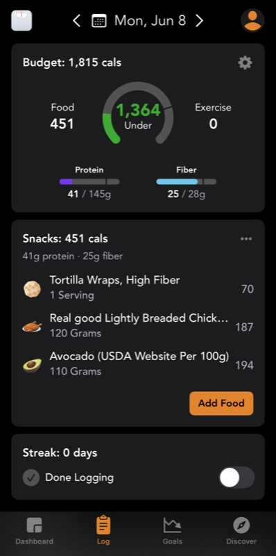
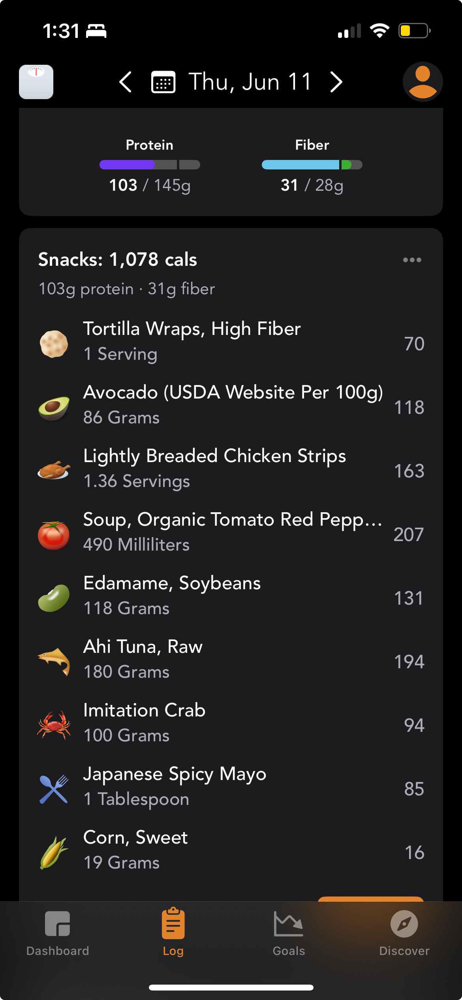

<h1 align="center">loseit</h1>

<p align="center">Unofficial Python SDK + CLI for <a href="https://www.loseit.com/"><b>Lose It!</b></a> — log meals, query your diary, and delete entries from the command line.</p>

<p align="center">
  
</p>

<p align="center">
  <a href="pyproject.toml"></a>
  <a href="https://github.com/phitoduck/lose-it/actions/workflows/ci.yml"></a>
  <a href="https://github.com/phitoduck/lose-it/actions/workflows/ci.yml"></a>
  <a href="LICENSE"></a>
</p>

> ⚠️ **Reverse-engineered & unofficial.** Talks to Lose It!'s private GWT-RPC web endpoints. No official API exists; the protocol is brittle and may break without notice. Not affiliated with Lose It! / FitNow, Inc.

## Table of contents

- [Quickstart](#quickstart)
- [Claude Code SKILL.md](#claude-code-skillmd)
- [Subcommands](#subcommands)
  - [`login`](#login--import-the-auth-token-and-populate-the-config)
  - [`search`](#search)
  - [`log`](#log)
  - [`diary`](#diary)
  - [`describe-food`](#describe-food)
  - [`delete`](#delete)
  - [`backup`](#backup)
  - [`restore-backup`](#restore-backup)
  - [`restore-trash`](#restore-trash)
  - [`whoami`](#whoami)
  - [Script-friendly output: `--output json` / `-o json`](#script-friendly-output---output-json---o-json)
  - [LLM-friendly output: `--output toon` / `-o toon`](#llm-friendly-output---output-toon---o-toon)
  - [Preview without mutating: `--dry-run`](#preview-without-mutating---dry-run)
  - [Verbose logging: `--log-level` / `--log-file`](#verbose-logging---log-level---log-file)
- [Configuration](#configuration)
- [SDK](#sdk)
- [Develop](#develop)
- [Known quirks (annotated in the parser)](#known-quirks-annotated-in-the-parser)
- [License](#license)

## Quickstart

You need to already be signed into [loseit.com](https://www.loseit.com/) in Chrome or Brave.

```bash
# 1. Install the CLI (system-wide via uv)
uv tool install git+https://github.com/phitoduck/lose-it

# 2. Import your auth token AND populate the config from the browser
loseit login                       # default: --browser chrome
# or:  loseit login --browser brave

# 3. You're ready
loseit diary
```

## Claude Code [SKILL.md](skills/log-food/SKILL.md)

### Install

```bash
claude plugin marketplace add phitoduck/lose-it
claude plugin install log-food@lose-it
```

### Example

Either invoke the skill explicitly with `/log-food`, or just describe your meal — the skill's triggers fire on natural-language phrases too.

**Claude Code Prompt:**

> **/log-food** Log 1 Xtreme carb balance tortilla, 110g of avocado, and 120g of real good brand lightly breaded chicken strips

**Result:**

<p align="center">
  
</p>

### Complex example — multi-food meal + diary cleanup

A messier, real-world prompt. Fuzzy quantities, a guessed-at sauce, "a few bites" of corn, *and* an aside asking the skill to clean up duplicate entries — handled in a single turn:

**Claude Code Prompt:**

> **/log-food** I ordered some poke today today there was a bowl with a bunch of edamame in it. Probably three quarters cup of edam edamame. And I would guess like three quarter cup of Ahi tuna and three quarter cup of crab imitation meat and there was this white sauce on it I'm not sure what it was uh presumably some sauce that's common to serve with uh poke bowls with imitation crab. And I had a few bites of corn. So that'll need to be converted into whatever unit makes sense for a guess of that. And that's all for that meal. Now, I also erroneously added too many entries to my food log today. So for example, there are multiple logs for Trader Joe's tomato soup. There should only be one. So the redundant ones should be deleted.

**Result:**

<p align="center">
  
</p>

<details>
<summary>Click to expand — full reasoning the skill went through</summary>

#### 1. Refresh CLI + read today's diary

```bash
$ uv tool install --reinstall git+https://github.com/phitoduck/lose-it
$ loseit -o toon diary
```
```text
date: 2026-06-12
count: 0
entries[0]:
```

Diary for system-today is empty — but the user said they have duplicates "today". Server-side date (UTC) likely ahead of the user's local "today". Re-checked the day before:

```bash
$ loseit -o toon diary --date 2026-06-11
```
```text
date: 2026-06-11
count: 7
entries[7]:
  - meal: snacks
    food_name: "Tortilla Wraps, High Fiber, Low Carb, Xtreme Wellness"
    ...
  - meal: snacks
    food_name: "Soup, Organic Tomato Red Pepper low sodium (TJ: 8 fl oz)"
    food_brand: "Trader Joe's"
    servings: 2.07111
    calories: 207.11
    food_pk[16]: -99,86,123,115,7,-99,-115,-82,-80,76,-70,-47,32,-79,70,116
    food_measure_ordinal: 11
  - meal: snacks
    food_name: "Soup, Organic Tomato Red Pepper low sodium (TJ: 8 fl oz)"
    food_brand: "Trader Joe's"
    servings: 2.07111
    calories: 207.11
    food_pk[16]: -99,86,123,115,7,-99,-115,-82,-80,76,-70,-47,32,-79,70,116
    food_measure_ordinal: 11
    ...
```

Found the duplicates: snacks #4 and #5 — identical `food_pk`, identical servings, identical calories. Delete one.

#### 2. Delete the duplicate

```bash
$ loseit delete --meal snacks --pick 5 --date 2026-06-11 --yes
🗑️  Deleting from snacks: Soup, Organic Tomato Red Pepper low sodium ... × 2.07111
✅ Deleted
```

#### 3. Parse the prompt into entries

| Component | Quantity | Notes |
|---|---|---|
| Edamame | "three quarters cup" | restaurant edamame = shelled cooked |
| Ahi tuna | "three quarter cup" | raw poke cubes |
| Imitation crab | "three quarter cup" | shredded flakes |
| White sauce | "presumably some sauce…" | most common with imitation-crab poke = spicy/Japanese mayo, estimate 1 tbsp |
| Corn | "a few bites" | estimate ≈ 2 tbsp ≈ 19 g sweet kernels |

#### 4. Search → describe-food → sanity-check calories

```bash
$ loseit -o toon search "edamame"
$ loseit -o toon search "ahi tuna"
$ loseit -o toon search "imitation crab"
$ loseit -o toon search "spicy mayo"
$ loseit -o toon search "corn"
```

Picked top 3-4 candidates per food and inspected them in one batched call each (`describe-food` runs concurrent fetches):

```bash
$ loseit -o toon describe-food <id1> <id2> <id3>
```
```text
foods[3]:
  - food_id: 6cad82c0a6f432ba0b4fa48be3a7598e
    name: "Ahi Tuna, Raw"
    primary_serving: {ordinal: 6, native_qty_per_serving: 1.0}
    cross_class_conversion: {per_serving_g: 28.3495}
    nutrients_per_serving: {calories: 30.5, protein_g: 6.6, total_fat_g: 0.3, ...}
    # = ~108 cal/100g, matches USDA → good pick
  - food_id: b76c03e3a749bfbfb14d148a8c0ac042
    name: "Fish, Poke, Ahi Tuna"
    nutrients_per_serving: {calories: 75.0, ..., serving_weight_g: 85.05}
    # = ~88 cal/100g, ~20% low vs USDA → skip
  ...
```

Final picks (each verified to support gram/tbsp logging via `cross_class_conversion`):

| Component | food_id | Per-serving math sanity |
|---|---|---|
| Edamame, Soybeans, Cooked & Shelled | `f227…` | 100 cal / 90 g ≈ 111 cal/100g ✓ |
| Ahi Tuna, Raw | `6cad…` | 30.5 cal / 28.35 g ≈ 108 cal/100g ✓ (USDA) |
| Imitation Crab (Crab classic) | `3558…` | 80 cal / 85 g ≈ 94 cal/100g ✓ |
| Japanese Spicy Mayo | `b460…` | 170 cal / 2 tbsp = 85 cal/tbsp ✓ |
| Corn, Sweet, Kernels | `e608…` | 86 cal / 100 g ✓ |

#### 5. Dry-run before mutating

First attempt hit a CLI signature error:

```bash
$ loseit log "edamame" --food-id f227… -m snacks --date 2026-06-11 \
    --serving-amount 118 --serving-unit g --dry-run
❌ --food-id and <query>/--pick are mutually exclusive
```

`--food-id` doesn't take a positional query. Dropped it and retried:

```bash
$ loseit log --food-id f227… -m snacks --date 2026-06-11 \
    --serving-amount 118 --serving-unit g --dry-run
🟡 DRY RUN — would log Edamame, Soybeans, Cooked & Shelled (id f227…) → snacks 118 g (131 cal)
```

All five dry-runs passed; cal numbers matched the per-serving math above.

#### 6. Log for real

```bash
$ loseit log --food-id f227… -m snacks --date 2026-06-11 --serving-amount 118 --serving-unit g
✅ Logged Edamame, Soybeans, Cooked & Shelled (id f227…) → snacks 118 g (131 cal)
$ loseit log --food-id 6cad… -m snacks --date 2026-06-11 --serving-amount 180 --serving-unit g
✅ Logged Ahi Tuna, Raw (id 6cad…) → snacks 180 g (194 cal)
$ loseit log --food-id 3558… -m snacks --date 2026-06-11 --serving-amount 100 --serving-unit g
✅ Logged Imitation Crab (id 3558…) → snacks 100 g (94 cal)
$ loseit log --food-id b460… -m snacks --date 2026-06-11 --serving-amount 1 --serving-unit tbsp
✅ Logged Japanese Spicy Mayo (id b460…) → snacks 1 tbsp (85 cal)
$ loseit log --food-id e608… -m snacks --date 2026-06-11 --serving-amount 19 --serving-unit g
✅ Logged Corn, Sweet, Kernels (id e608…) → snacks 19 g (16 cal)
```

Poke bowl total: **520 cal**. Verified via `loseit -o toon diary --date 2026-06-11` — `food_measure_unit` and `nutrients_by_label.calories` matched the dry-run on every entry.

</details>

## Subcommands

**Bash:**

```bash
$ loseit --help
```

**Output:**

```text
 Usage: loseit [OPTIONS] COMMAND [ARGS]...

 Unofficial Lose It! food logger / diary CLI.

╭─ Commands ──────────────────────────────────────────────────────╮
│ login          Import the liauth JWT from Chrome or Brave.      │
│ search         Search the LoseIt food database.                 │
│ log            Search for a food and log it to a meal.          │
│ diary          List the diary for a given date (default: today).│
│ describe-food  Inspect one or more foods by ID; fetch concurrent│
│ delete         Delete a diary entry. Writes to trash first.     │
│ backup         Archive the diary to ~/.local/share/loseit/      │
│ restore-backup Re-log archived entries that are missing on the  │
│                server. Safe-mode upsert by default.             │
│ restore-trash  Replay the most recent loseit delete trash record│
│ whoami         Print the resolved client configuration.         │
╰─────────────────────────────────────────────────────────────────╯
```

### `login` — import the auth token *and* populate the config

**Bash:**

```bash
$ loseit login --browser chrome
```

**Output:**

```text
✅ Imported liauth from Chrome → /Users/you/.config/loseit/token
   JWT exp: 2026-06-22T20:41:44+00:00
✅ Wrote config → /Users/you/.config/loseit/config.yaml
   user_name     : you@example.com
   hours_from_gmt: -6
   user_id       : 12345678
```

**Bash:**

```bash
$ loseit login --browser brave
```

**Output:**

```text
❌ liauth cookie in Brave is expired.
   JWT exp: 2026-04-01T12:00:00+00:00 (now: 2026-06-08T19:30:00+00:00)
   Opened https://www.loseit.com/ in Brave.
   Then re-run: loseit login --browser brave
```

<details>
<summary>click to view details...</summary>

The first run on macOS triggers a Keychain prompt so the OS can unlock the browser's cookie store. After that it's silent. If neither the JWT nor any `loseit.com` cookie carries your username, `loseit login` prompts once and saves it to the YAML. Pass `--user-name alice@example.com` to skip the prompt (handy in CI), or `--no-write-config` to import only the token.

</details>

### `search`

**Bash:**

```bash
$ loseit search "x-treme carb balance tortilla"
```

**Output:**

```text
  #  Food                                               Brand                Food ID
───  ────────────────────────────────────────────────── ──────────────────── ───────────
  1  Xtreme Wellness Tortilla Wrap High Fiber Low Carb  Carb balance         9eba9129b8…
  2  Tortilla Wraps, High Fiber, Low Carb, Xtreme Welln Mission Tortillas Ca 0d5f30bf42…
```

<details>
<summary>click to view details...</summary>

The `Food ID` column is the lowercase-hex form of the food's stable 16-byte primary key. The text view truncates it to 10 chars; the full 32-char value is in the JSON `food_id` field (`loseit search ... -o json`).

</details>

### `log`

**Bash:**

```bash
$ loseit log "x-treme carb balance tortilla" --meal lunch --pick 2 --servings 1
```

**Output:**

```text
  #  Food                                               Brand                Food ID
───  ────────────────────────────────────────────────── ──────────────────── ───────────
  1  Xtreme Wellness Tortilla Wrap High Fiber Low Carb  Carb balance         9eba9129b8…
  2  Tortilla Wraps, High Fiber, Low Carb, Xtreme Welln Mission Tortillas Ca 0d5f30bf42…

✅ Logged Tortilla Wraps, High Fiber, Low Carb, Xtreme Wellness (id 0d5f…) → lunch 1 serving (70 cal)
```

<details>
<summary>click to view details...</summary>

For unit-based logging, pass `--serving-amount N --serving-unit X` where `X` is one of `tsp`, `tbsp`, `cup`, `piece`, `each`, `g`, `fl_oz`, `mL`, `bottle`, `can`, `slice`, `serving`, `scoop`, `container`, `pie` (plus common aliases):

</details>

**Bash:**

```bash
$ loseit log "tj tomato soup" --pick 3 -m snacks --serving-amount 490 --serving-unit ml
```

**Output:**

```text
✅ Logged Soup, Organic Tomato Red Pepper low sodium (TJ: 8 fl oz) → snacks 490 mL (207 cal)
```

**Bash:**

```bash
$ loseit log "avocado per 100g" --pick 8 -m snacks --serving-amount 110 --serving-unit g
```

**Output:**

```text
✅ Logged Avocado (USDA Website Per 100g) → snacks 110 grams (137 cal)
```

<details>
<summary>click to view details...</summary>

The CLI handles same-class conversions (e.g. cup ↔ mL ↔ fl_oz) via a generic table. **For cross-class conversions** (e.g. asking for grams against a food natively measured in "serving") the CLI falls back to the food's own `per_serving_g` / `per_serving_ml` values stored in its nutrient HashMap. Example: Realgood chicken strips are stored as "1 serving" but the food's wire data carries `per_serving_g=112`, so:

</details>

**Bash:**

```bash
$ loseit log "realgood foods chicken" --pick 1 -m snacks --serving-amount 152 --serving-unit g
```

**Output:**

```text
✅ Logged Lightly Breaded Chicken Strips → snacks 152 g (163 cal)
```

<details>
<summary>click to view details...</summary>

If neither the generic table nor the food's nutrients can supply the conversion, the CLI errors with `unit_not_supported` and tells you which native unit the entry uses.

Pick indices drift between sessions (Lose It! mutates its index). For drift-proof, scriptable logging, pass the stable `--food-id` instead — it skips the search step entirely:

</details>

**Bash:**

```bash
$ loseit log --food-id 0d5f30bf4231a3da8c3c9608f0630010 --meal snacks --servings 1.0
```

**Output:**

```text
✅ Logged Organic Tomato And Roasted Red Pepper Soup (id 0d5f…) → snacks 1 serving (207 cal)
```

<details>
<summary>click to view details...</summary>

`--food-id` is mutually exclusive with the positional `<query>` and `--pick`; pass exactly one.

</details>

### `diary`

**Bash:**

```bash
$ loseit diary
```

**Output:**

```text
📅 Diary for 2026-06-08:

  Lunch:
    1. Tortilla Wraps, High Fiber, Low Carb, Xtreme Wellness (Mission)  × 1.0  [70 cal]
    2. Avocado, whole (Ocado)                                           × 0.55 [177 cal]
    3. Real Good Lightly Breaded Chicken Strips (Real Good Foods)       × 1.43 [186 cal]

  Snacks:
    1. Greek Yogurt, Strawberry, Non Fat (Chobani)                      × 1.0  [110 cal]
```

### `describe-food`

<details>
<summary>click to view details...</summary>

Inspect one or more foods by ID; emits labeled nutrient + cross-class conversion data. Foods are fetched concurrently via `asyncio.to_thread`, so N foods take ~max(per-request-latency) rather than the sum:

</details>

**Bash:**

```bash
$ loseit -o json describe-food 4465349443cea79c404de42baac3b73e c5d8f3b75e3045f0a98c7c7f5f4d9d6a
```

**Output:**

```json
{
  "count": 2,
  "foods": [
    {
      "food_id": "4465349443cea79c404de42baac3b73e",
      "name": "Lightly Breaded Chicken Strips ",
      "brand": "Realgood Foods Co.",
      "primary_serving": {"ordinal": 27, "unit": "serving", "native_qty_per_serving": 1.0},
      "cross_class_conversion": {"per_serving_g": 112.0, "per_serving_ml": null},
      "nutrients_per_serving": {
        "calories": 120.0, "total_fat_g": 5.0, "saturated_fat_g": 1.5,
        "cholesterol_mg": 60.0, "sodium_mg": 380.0, "carb_g": 4.0,
        "fiber_g": 1.0, "sugar_g": 1.0, "protein_g": 21.0,
        "serving_weight_g": 112.0,
        "unknown_nutrient_18": 30.0, "unknown_nutrient_22": 300.0
      }
    }
  ]
}
```

<details>
<summary>click to view details...</summary>

The `per_serving_g` / `per_serving_ml` values are what unlock cross-class `--serving-unit` logging (see `log` above). Useful for debugging which unit combinations a food supports.

</details>

### `delete`

Every delete is recoverable. Before the wire-delete fires, the full entry payload is written to a **trash sink** (default: a JSONL file at `~/.local/share/loseit/trash.jsonl`, mode `0600`). If the trash write fails, the delete is **aborted** — your entry stays on the server.

**Bash:**

```bash
$ loseit delete --meal lunch --pick 1 --yes
```

**Output:**

```text
🗑️  Deleting from lunch: Tortilla Wraps, High Fiber, Low Carb, Xtreme Wellness (Mission) × 1.0
  trash sink: /Users/you/.local/share/loseit/trash.jsonl#42
  (run 'loseit restore-trash' to undo the most recent delete)
✅ Deleted
```

<details>
<summary>click to view details — trash flags + recovery</summary>

```text
--trash-file PATH      Override the trash file path.
                       Default: ~/.local/share/loseit/trash.jsonl.
--print-deleted        Echo the full deleted entry to stdout (TOON).
                       Default: on. Useful when the CLI runs in a
                       container — the agent's transcript becomes
                       a second copy of the trash record.
--no-trash             Explicit opt-out. Refuses unless paired with
                       --i-know-this-is-unrecoverable.
--i-know-this-is-unrecoverable
                       Acknowledge that --no-trash discards any
                       chance of recovery.
```

To undo the most recent delete:

```bash
$ loseit restore-trash
```

(see the [`restore-trash`](#restore-trash) section below).

</details>

### `backup`

Archive your whole diary to local disk. One TOON file per **grain** (default: month), atomic per-grain so a Ctrl-C is safe to resume. By default uses the bulk-fetch endpoint — **1 RPC per grain**, not one per day.

**Bash:**

```bash
$ loseit backup
```

**Output:**

```text
discovering earliest day...
  probed 2019-08              hit
  narrowing within 2019-08:
    probed 2019-08-01 .. 2019-08-13   empty
    probed 2019-08-14              hit
earliest day:         2019-08-14
range:                2019-08-14 -> 2026-06-12  (2495 days, 83 months)
grain:                month
root:                 /Users/you/.local/share/loseit/backup

fetch     2019/08.toon   18 days  [######################]   3 entries
fetch     2019/09.toon   30 days  [######################]  12 entries
...
fetch     2026/06.toon   12 days  [######################]  42 entries

summary
  months fetched:     83  (skipped 0,  partial 0,  fetched 83,  fell back 0)
  days fetched:       2495
  days with entries:  2358
  unique foods:       312 described,  0 re-described today
  archive size:       11.4 MB
  root:               /Users/you/.local/share/loseit/backup
```

Re-runs **resume** — already-complete grain files are skipped with `0` RPCs:

```bash
$ loseit backup --quiet-skips     # collapse contiguous skips to one line
```

```text
skip      2019/08.toon .. 2026/04.toon   80 grains complete (2349 days, 4146 entries)
partial   2026/05.toon   need 8 more days (3 already on disk)
            fetch 2026-05-04 .. 2026-05-31  [######################]  14 entries
fetch     2026/06.toon   12 days  [######################]  42 entries
```

<details>
<summary>click to view details — all flags</summary>

```text
--root PATH            Backup root. Default: ~/.local/share/loseit/backup.
--grain {day,week,month}
                       Granularity of the on-disk files. Default: month.
--start YYYY-MM-DD     First date to fetch (inclusive).
                       Default: discover via probe.
--end   YYYY-MM-DD     Last date to fetch (inclusive). Default: today.
--probe-from YYYY-MM-DD
                       Earliest date the discovery probe will consider.
                       Default: 2015-01-01.
--sleep-seconds FLOAT  Seconds between per-day fetches. Default: 1.0.
--resume / --no-resume Skip grain files already complete on disk.
                       Default: --resume.
--refresh-foods        Re-fetch food descriptions even if cached.
--quiet-skips          Collapse contiguous skip ranges into one line.
--dry-run              Print the plan and exit — no RPCs sent.
```

Grain file format (TOON, human-grep-able):

```text
~/.local/share/loseit/backup/
  index.toon                          <- discovery cache
  foods.toon                          <- food description cache
  2019/
    08.toon                           <- August 2019: entries
    09.toon
    ...
  2026/
    06.toon
```

If a month-level fetch oversizes, the splitter falls back to week-grain, then day-grain. Status column in the output reflects the fall-back: `fallback  2024/12.toon   succeeded at day grain  (17 days, 76 entries)`.

</details>

### `restore-backup`

Re-log archived entries that are missing on the server. **Safe by default** — never double-logs, never deletes.

**Bash:**

```bash
$ loseit restore-backup
```

**Output:**

```text
account:              loseit user_id 12345678
backup root:          /Users/you/.local/share/loseit/backup
grain:                month
mode:                 safe (upsert by food_id + modified_at ± 10m)

2019/08.toon  18 days with entries  [######################]
                 present  18   upsert  0   empty  0
...
2026/05.toon  18 days with entries  [######################]
                 present  16   upsert  2   empty  0   (logged 5 new entries)
2026/06.toon   8 days with entries  [######################]
                 present   8   upsert  0   empty  0

summary
  grains scanned:       83
  days scanned:         2358
  entries already present: 4213
  entries logged:           5
```

A second run against an unchanged server logs **0** entries. The upsert key matches existing server rows by `food_id` + `modified_at ± 10 min`.

<details>
<summary>click to view details — modes, flags</summary>

Two modes:

- **Safe mode (default)** — per-day entry-level upsert. Reads every day-with-entries from the server; only logs entries the server doesn't already have. The match key is `(food_id, modified_at ± 10 min)`. ⚠️ Note: the spec originally called for `created_at` here, but empirical decoding showed `FoodLogEntry.f4` is not a real timestamp (values cluster at 1970). `modified_at` (f5) is the real, reliable timestamp.

- **Cheap mode** — `--skip-restore-on-nonempty-grain-time-ranges`. Walks each grain's days; **skips the whole grain** on the first non-empty day. Cheaper on reads but coarser on writes — if the server has 1 mobile-logged entry in a grain you're trying to restore 50 entries into, this mode restores nothing in that grain.

```text
--root PATH                          Backup root. Default: ~/.local/share/loseit/backup.
--grain {day,week,month}             Default: month.
--start YYYY-MM-DD                   Earliest grain. Default: archive's earliest.
--end   YYYY-MM-DD                   Latest grain. Default: archive's latest.
--skip-restore-on-nonempty-grain-time-ranges
                                     Cheap mode (see above).
--strict-account / --no-strict-account
                                     Refuse to restore if the archive's
                                     account.user_id doesn't match.
                                     Default: --strict-account.
--upsert-window-minutes INT          Match window in safe mode. Default: 10.
--sleep-seconds FLOAT                Default: 1.0.
--quiet-skips                        Collapse contiguous skips.
--dry-run                            Print the plan; no RPCs sent.
```

There is no `--reconcile`, no `--prune-extras`, no delete path. Restore is purely additive in both modes.

</details>

### `restore-trash`

Replay a `loseit delete` trash record back to the server.

**Bash:**

```bash
$ loseit restore-trash
```

**Output:**

```text
restoring trash#42 (last line)
  food: Tortilla Wraps, ... (Mission)
  meal: lunch
  date: 2026-06-12
  servings: 1.0

logged successfully (new entry id: 5c7218603fd35a86bc4fac771a54560d)
trash#42 consumed.
```

<details>
<summary>click to view details — pick a specific line, keep the trash file</summary>

```text
--trash-file PATH       Source trash file.
                        Default: ~/.local/share/loseit/trash.jsonl.
--line INT              Restore line N (1-based) instead of the last.
--keep / --consume      Keep the trash line after restoring, or
                        remove it (default).
--dry-run               Print which line would be restored, no RPCs.
```

Restore the second-most-recent delete without consuming the trash record:

```bash
$ loseit restore-trash --line 2 --keep
```

</details>

### `whoami`

**Bash:**

```bash
$ loseit whoami
```

**Output:**

```text
user_id        : 12345678
user_name      : your.username
hours_from_gmt : -6
policy_hash    : 8F87EC8969F17AE77B6283D3A83F6D4C
strong_name    : 351AE5DC0CA36AD3BA9C7CBA7B0E07B8
```

### Script-friendly output: `--output json` / `-o json`

<details>
<summary>click to view details...</summary>

Every subcommand accepts a global `--output` (alias `-o`) flag. The default is `text`; pass `json` to get a JSON document on stdout suitable for piping into `jq`.

</details>

**Bash:**

```bash
$ loseit -o json diary --date 2026-06-08 | jq '.entries[] | .food_name'
```

**Output:**

```json
"Tortilla Wraps, High Fiber, Low Carb, Xtreme Wellness"
"Avocado, whole"
"Real Good Lightly Breaded Chicken Strips"
```

<details>
<summary>click to view details...</summary>

Diary entries include a `nutrients_by_label` field that maps the food's nutrient HashMap to human-readable nutrient names (`calories`, `total_fat_g`, `sat_fat_g`, `cholesterol_mg`, `sodium_mg`, `carb_g`, `fiber_g`, `sugar_g`, `protein_g`, `serving_weight_g`, `serving_volume_ml`, …) alongside the raw `nutrients` map keyed by ordinal. The `food_measure_unit` field labels the entry's stored unit (`grams`, `cup`, `serving`, `scoop`, etc.) — see the `FoodMeasurement` and `FoodNutrient` enums in `client/_enums.py` for the full table.

</details>

**Bash:**

```bash
$ loseit -o json diary | jq '.entries[0] | {food_name, food_measure_unit, servings, nutrients_by_label}'
```

**Output:**

```json
{
  "food_name": "Avocado (USDA Website Per 100g)",
  "food_measure_unit": "grams",
  "servings": 86.0,
  "nutrients_by_label": {
    "calories": 118.3, "total_fat_g": 11.1, "carb_g": 6.7, "sugar_g": 0.5,
    "fiber_g": 5.2, "protein_g": 1.5, "sodium_mg": 5.2,
    "serving_weight_g": 73.96
  }
}
```

### LLM-friendly output: `--output toon` / `-o toon`

<details>
<summary>click to view details...</summary>

Pass `toon` to render the same payload as [Token-Oriented Object Notation](https://toonformat.dev) — a compact, JSON-equivalent format designed for shovelling structured data into LLM prompts. The data shape is identical to `-o json` (you can round-trip it through `toon-format`), but it spends ~40–60% fewer characters (and tokens) on arrays of records because field names are pulled into a single header row.

</details>

**Bash:**

```bash
$ lose-it -o toon search "tortilla"
```

**Output:**

```yaml
query: tortilla
count: 3
results[3]:
  - name: "Tortilla Wraps, High Fiber, Low Carb"
    brand: Mission
    category: Bread
    food_id: 9eba9129b8494967c8cb3385acf0f614
  ...
```

<details>
<summary>click to view details...</summary>

`food_id` is the only identifier the CLI itself accepts (`--food-id`, `describe-food`). Pass `--verbose` / `-v` to also include the raw 16-int `pk_bytes` array — useful when driving the SDK from Python code, just noise otherwise.

On a typical 3-row search payload, the JSON view is ~900 chars and the TOON view ~470 chars — about a ~48% reduction. Round-tripping the TOON output through a decoder produces the same Python dict as `json.loads` of the JSON output, so anything downstream that wants real JSON can recover it on demand:

</details>

```python
import toon_format
data = toon_format.decode(toon_output)
```

### Preview without mutating: `--dry-run`

<details>
<summary>click to view details...</summary>

`log` and `delete` accept `--dry-run`. Read-only lookups still run (so you see what *would* be logged or deleted), but the mutating RPC is skipped.

</details>

**Bash:**

```bash
$ loseit log "x-treme carb balance tortilla" -m lunch --pick 2 --dry-run
```

**Output:**

```text
🟡 DRY RUN — would log Tortilla Wraps, High Fiber, Low Carb, Xtreme Wellness → lunch × 1.0 (70 cal)
```

### Verbose logging: `--log-level` / `--log-file`

<details>
<summary>click to view details...</summary>

Every subcommand accepts two global logging flags (powered by [loguru](https://github.com/Delgan/loguru)):

- `--log-level {trace|debug|info|success|warning|error|critical}` (env: `LOSEIT_LOG_LEVEL`) — verbosity for logs emitted on **stderr**. Default: **muted** (the CLI is silent unless you opt in).
- `--log-file PATH` (env: `LOSEIT_LOG_FILE`) — append a **full TRACE-level transcript** of the session to this file. The file sink always captures at TRACE regardless of `--log-level`, so you can keep the console quiet and still get the wire dump on disk.

The levels, from loudest to quietest:

</details>

| Level | What you get |
|---|---|
| `trace` | Full HTTP request + response dumps: URL, full GWT-RPC body for each direction. Headers + auth cookies are **suppressed by default** — pass `--log-headers` to include them. |
| `debug` | One-liner per RPC (`rpc <method>: POST <url> → <status> in Xms`), payload sizes, parser intermediates. |
| `info` | High-level events: CLI command + args, search queries, food lookups, log/delete intent, resolved user. |
| `success` | Mutating RPCs that returned `//OK`. |
| `warning` | Degraded paths (empty diaries, missing day-keys, fallback parses). |
| `error` | HTTP 4xx/5xx, GWT `//EX[…]` errors, transport failures. |

<details>
<summary>click to view details...</summary>

**`--log-level info`** — one line per high-level event:

</details>

**Bash:**

```bash
$ loseit --log-level info search "tortilla" 1>/dev/null
```

**Output:**

```text
12:00:00.123 INFO     lose_it.cli:search:344 cli.search: query='tortilla' output=text
12:00:00.135 INFO     lose_it.client:from_env:184 LoseIt.from_env: user='you@example.com' hours_from_gmt=-6 permutation=351AE5DC0CA36AD3BA9C7CBA7B0E07B8
12:00:00.140 INFO     lose_it.core.foods:search:183 foods.search: query='tortilla'
12:00:00.330 SUCCESS  lose_it.core._http:post_rpc:205 rpc searchFoods OK in 188.5 ms (2764 bytes)
```

<details>
<summary>click to view details...</summary>

**`--log-level trace`** — dumps every request and response in full, headers included. Useful for reverse-engineering the GWT-RPC surface:

</details>

**Bash:**

```bash
$ loseit --log-level trace search "avocado" 1>/dev/null
```

**Output:**

```text
12:00:00.123 TRACE    lose_it.client._http:post_rpc:121 HTTP REQUEST → searchFoods
POST https://www.loseit.com/web/service
(headers + cookies suppressed — re-run with --log-headers to include)
── body (380 bytes) ──
7|0|12|https://d3hsih69yn4d89.cloudfront.net/web/|8F87EC8969F17AE77B6283D3A83F6D4C|com.loseit.core.client.service.LoseItRemoteService|searchFoods|com.loseit.core.client.service.ServiceRequestToken/1076571655|java.lang.String/2004016611|I|Z|com.loseit.core.client.model.UserId/4281239478|you@example.com|avocado|en-US|1|2|3|4|6|5|6|6|7|8|8|5|0|9|12345678|10|-6|11|12|15|1|1|
12:00:00.310 TRACE    lose_it.client._http:post_rpc:150 HTTP RESPONSE ← searchFoods
HTTP/1.1 200 (188.4 ms)
── body (2764 bytes) ──
//OK[0,17,2,42,40,13,-51,-6,9290,"Z6mB_lo",...]
```

<details>
<summary>click to view details...</summary>

**`--log-file`** — captures a full session to disk (TRACE-level by default), regardless of `--log-level`. The file format uses pipe-separated columns so it round-trips cleanly through `less` / `grep`:

</details>

**Bash:**

```bash
$ loseit --log-file ~/loseit-session.log diary
$ grep -E "rpc.*OK" ~/loseit-session.log
```

**Output:**

```text
2026-06-11 12:00:00.578 | SUCCESS  | lose_it.client._http:post_rpc:205 | rpc getInitializationData OK in 159.1 ms (10306 bytes)
2026-06-11 12:00:00.672 | SUCCESS  | lose_it.client._http:post_rpc:205 | rpc getDailyDetailsIncludingPendingForDate OK in 92.7 ms (7610 bytes)
```

<details>
<summary>click to view details...</summary>

> ⚠️ **Heads up:** by default the `── headers ──` / `── cookies ──` sections are **omitted** from the TRACE dump even at `--log-level trace`. Pass `--log-headers` to opt in — and only when you're actually debugging an auth/header issue, because the `liauth` and `fn_auth` cookies are bearer JWTs for your Lose It! account. If you do enable headers, treat any `--log-file` output as sensitive and scrub before sharing. The repo's gitleaks config (see [Lint, format, secret-scan (prek)](#lint-format-secret-scan-prek)) blocks any commit containing a real `liauth`/`fn_auth` JWT exactly to prevent accidental disclosure.

</details>

## Configuration

The Quickstart used env vars because they're the fastest path. For anything more permanent, every setting can also come from a YAML file or a CLI flag.

### Priority (highest wins)

1. **CLI flag** — e.g. `loseit --user-id 12345678 whoami`
2. **`LOSEIT_*` env var** — e.g. `LOSEIT_USER_ID=…`
3. **YAML file** — default path `~/.config/loseit/config.yaml`
   (override with `--config-file` or `LOSEIT_CONFIG_FILE`)
4. **Built-in default** — applied when no other layer sets the field

`user_id`, `user_name`, and `hours_from_gmt` have **no defaults** — the SDK raises `MissingConfigError` rather than silently posting to the wrong account. `loseit login` writes all three to the YAML on first run, so you only hit this error if you skipped the login flow (e.g. running in CI).

### YAML file (most ergonomic for long-term setup)

```yaml
# ~/.config/loseit/config.yaml — every key matches a field in the Settings model.
user_id: "12345678"
user_name: your.username
hours_from_gmt: -6

# Optional — refresh from any /web/service POST in DevTools when requests
# start failing with IncompatibleRemoteServiceException.
# policy_hash: 8F87EC8969F17AE77B6283D3A83F6D4C
# strong_name: 351AE5DC0CA36AD3BA9C7CBA7B0E07B8
```

### All settings

| YAML key / field  | CLI flag             | Env var                 | Type   | Default                                  | Description                                                                 |
|-------------------|----------------------|-------------------------|--------|------------------------------------------|-----------------------------------------------------------------------------|
| `user_id`         | `--user-id`          | `LOSEIT_USER_ID`        | `str`  | *(written by `loseit login`)*           | Numeric `sub` claim of your `liauth` JWT — `loseit login` extracts it for you.            |
| `user_name`       | `--user-name`        | `LOSEIT_USER_NAME`      | `str`  | *(written by `loseit login`)*           | Your loseit.com username — `loseit login` sniffs it from the JWT/cookies or prompts once. |
| `hours_from_gmt`  | `--hours-from-gmt`   | `LOSEIT_HOURS_FROM_GMT` | `int`  | *(written by `loseit login`)*           | Local offset from UTC (e.g. `-6`) — `loseit login` reads it from the OS timezone.         |
| `policy_hash`     | `--policy-hash`      | `LOSEIT_POLICY_HASH`    | `str`  | last-known-good                          | 5th `\|`-field of any `/web/service` POST body. Refresh on LoseIt redeploy. |
| `strong_name`     | `--strong-name`      | `LOSEIT_STRONG_NAME`    | `str`  | last-known-good                          | `x-gwt-permutation` request header. Refresh on LoseIt redeploy.             |
| `base_url`        | *(not exposed)*      | `LOSEIT_BASE_URL`       | `str`  | `https://d3hsih69yn4d89.cloudfront.net/web/` | GWT module base URL.                                                    |
| `service_url`     | *(not exposed)*      | `LOSEIT_SERVICE_URL`    | `str`  | `https://www.loseit.com/web/service`     | GWT-RPC service endpoint.                                                   |
| `token`           | *(not exposed)*      | `LOSEIT_TOKEN`          | `str`  | `None` → read from `token_file`          | `liauth` JWT. If unset, falls back to reading `token_file`.                 |
| `token_file`      | *(not exposed)*      | `LOSEIT_TOKEN_FILE`     | `Path` | `~/.config/loseit/token`                 | Where `loseit login` writes the JWT, and where the SDK reads it from.      |

The pydantic-settings model in [`src/lose_it/client/_settings.py`](src/lose_it/client/_settings.py) is the single source of truth and the spec of the YAML file.

### Refreshing the auth token

`loseit login` is the easy path; it reads the cookie out of Chrome or Brave (via `browser-cookie3`) and writes it to `~/.config/loseit/token`. The manual fallback:

```bash
# DevTools → Application → Cookies → www.loseit.com → liauth → copy value
mkdir -p ~/.config/loseit
echo "<paste JWT here>" > ~/.config/loseit/token
chmod 600 ~/.config/loseit/token
```

You can also set `LOSEIT_TOKEN=<jwt>` directly.

### Refreshing `policy_hash` / `strong_name`

When LoseIt redeploys, requests start failing with `LoseItError("…IncompatibleRemoteServiceException…")`. Open DevTools, find any `/web/service` POST:

- `strong_name` = the `x-gwt-permutation` request header
- `policy_hash` = the 5th `|`-separated field of the request body

### Not user-specific (and not secrets)

The `Class/<digits>` strings you'll see in the SDK source — `UserId/4281239478`, `ServiceRequestToken/1076571655`, `FoodIdentifier/2763145970`, … — are **GWT type-serialization hashes** computed by GWT at compile time from each Java class's structure. They're the same for every user of the same LoseIt build and are inlined in the public `*.cache.js` bundle on `d3hsih69yn4d89.cloudfront.net`. They're protocol type tags, not user/session/account identifiers.

## SDK

```python
from datetime import date

from lose_it import LoseIt, MealType, ServingUnit

with LoseIt.from_env() as li:
    when = date.today()

    # Search
    results = li.search("tortilla")
    chosen = results[0]

    # Log 1 serving to lunch — portion math, day-key lookup, and the
    # log RPC all happen inside this one call.
    logged = li.log_food(chosen, meal=MealType.lunch, servings=1.0, when=when)
    print(f"logged {logged.food.name} → {logged.meal_name} ({logged.calories:.0f} cal)")

    # Unit-based logging (e.g. 61 g of a tortilla wrap):
    li.log_food(chosen, meal="lunch",
                serving_amount=61, serving_unit=ServingUnit.g, when=when)

    # Read back the day's diary and pick out the entries we just logged.
    # `food_id` is the stable hex form of the food's primary key —
    # the same value `li.search(...)` and `li.log_food(...)` round-trip.
    just_logged = [e for e in li.diary(when) if e.food_id == chosen.food_id]
    for e in just_logged:
        print(f"{e.food_name}  × {e.servings}  [{e.calories} cal]")

    # Clean up: delete every entry we logged for this food.
    for e in just_logged:
        li.delete_entry(e)

    # JSON-safe projection of any model
    import json
    print(json.dumps(logged.to_dict(), indent=2))
```

The high-level `LoseIt` class wraps the lower-level RPC modules under `lose_it.core.{foods, entries, daily, init, auth}` — reach for those when you want direct control over a specific RPC (e.g. fixture capture).

## Develop

```bash
git clone https://github.com/phitoduck/lose-it
cd lose-it
uv sync
prek install                              # set up pre-commit hooks
uv run pytest                             # mocked unit tests (default)
uv run pytest -m requires_auth            # real-API CRUD (needs liauth + config)
```

### Package layout

```text
src/lose_it/
├── cli.py                  # typer CLI — one method per subcommand on `LoseIt`
├── client.py               # `LoseIt` (high-level) + `Client` (low-level)
└── core/                   # internal plumbing — stable contract is `LoseIt`
```


`core/` handles the GWT-RPC wire protocol — encoding requests and decoding responses into typed Python models — so `cli.py` and `client.py` only ever deal with plain objects.

### Tests

```bash
# Unit tests (mocked httpx, replay captured fixtures) + coverage
uv run pytest --cov=lose_it --cov-report=term-missing

# Only the real-API CRUD suite (needs a valid `liauth` JWT + LOSEIT_* config)
uv run pytest -m requires_auth

# Everything in one go
uv run pytest -m "requires_auth or not requires_auth"
```

Tests that hit the live Lose It! API are marked `@pytest.mark.requires_auth`. `pyproject.toml` sets `addopts = ["-m", "not requires_auth"]`, so a bare `pytest` excludes them automatically. Override with `-m requires_auth` to run only the live-API suite, or `-m "requires_auth or not requires_auth"` to run both. GitHub Actions runs the unit suite + coverage on every push/PR to `main` (Python 3.12, ubuntu-latest); the `requires_auth` suite is **not** run in CI because it needs a real `liauth` JWT on disk.

The `requires_auth` suite is the *source of truth* for the mock fixtures: each CRUD step writes the raw response body to `tests/conformance/fixtures/` (after redacting user_id / username). The unit tests then replay those fixtures through `pytest-httpx` mocks, so the mocked request/response shapes are guaranteed to match what the real Lose It! servers actually emit.

### Lint, format, secret-scan (prek)

`prek` (the Rust pre-commit drop-in) runs three classes of checks at commit *and* push time:

```bash
prek install            # one-time: wire the git hook
prek run --all-files    # run everything explicitly
```

| Hook | What it does |
|---|---|
| `pre-commit-hooks` | trailing whitespace, EOL, merge conflicts, large files, YAML/TOML syntax, `detect-private-key` |
| `ruff-check --fix` | lint + auto-fix Python with the ruleset in `pyproject.toml` |
| `ruff-format` | format all `.py` files (PEP 8, 100-char lines) |
| `gitleaks` | scan for secrets (default ruleset + custom Lose It! JWT rules); runs at both `pre-commit` and `pre-push` |

The gitleaks config has two custom rules: a tight ES384-JWT match (kid-agnostic, so signing-key rotations still trip it) and a fallback that catches any `liauth`/`fn_auth` cookie name beside a JWT-shaped value regardless of algorithm. The sanitized JWT placeholders in `tests/conformance/fixtures/` are allowlisted; everything else gets caught.

## Known quirks (annotated in the parser)

- **GWT writes byte arrays in reverse**: both PKs you see in responses are reversed copies of their wire-form bytes. `_gwt.reverse_bytes` handles round-trips.
- **GWT writes object fields in declaration order, dedup'd across an array**: when several `FoodLogEntry` objects share the same enum value (e.g. all in *snacks*) or the same nutrient HashMap (e.g. multiple identical logs), the response writes the shared value *once* and references it from each entry. The parser falls back to a global search when an entry's local range comes up empty.
- **Food codes can contain `$` and `_`**: e.g. `DoA3$q`. The food-identifier-code regex allows the full GWT short-string alphabet.
- **The serving-unit is the food's default**: `--servings N` is a multiplier on the food's canonical serving (1 wrap, 1 avocado, 1 scoop, etc.). For natural unit-based logging, use `--serving-amount N --serving-unit X` — the CLI converts to canonical servings via either the generic `CONVERSIONS` table (for same-class conversions like cup ↔ mL) or the food's own stored per-serving data (for cross-class cases like grams against a serving-measured food). See the `log` command above for examples.

## License

MIT.
