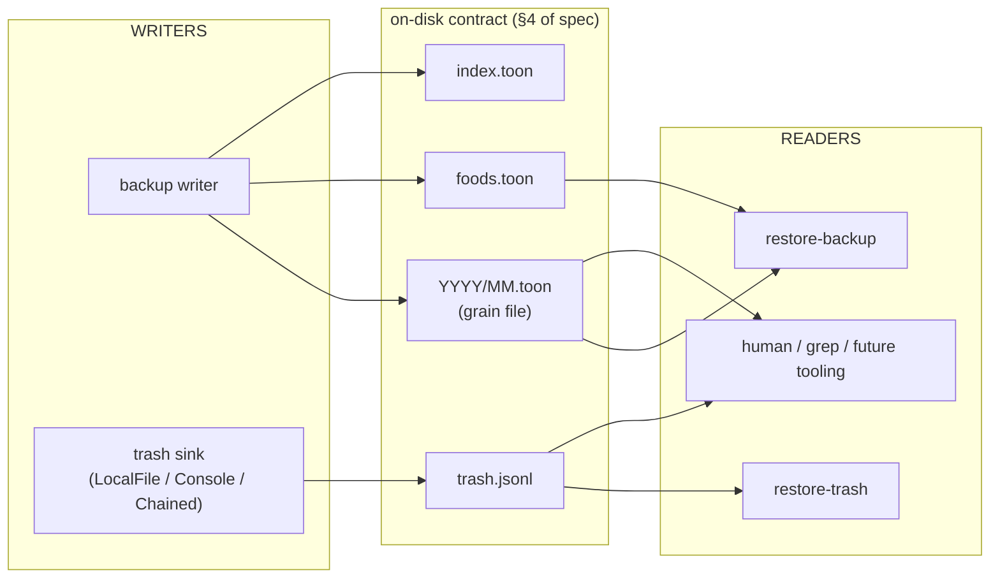
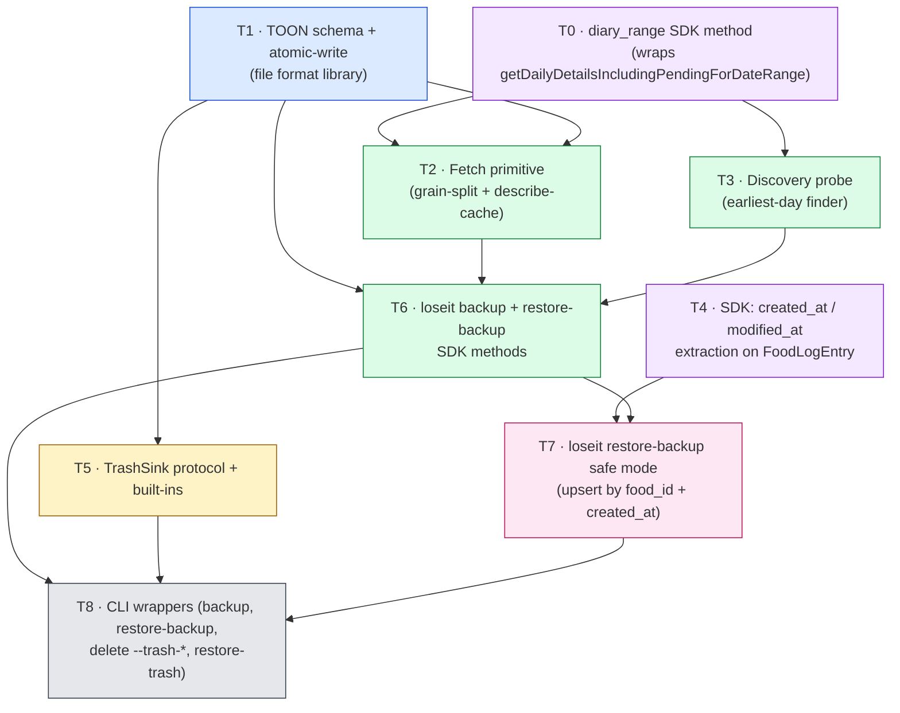

# Implementation plan: backup / restore-backup / trash

> Companion to [`backup-spec.md`](backup-spec.md). The spec describes
> intent and on-disk shapes; this document breaks the work into parallel
> tracks, names the seams between them, and pins down a conservative
> live-test strategy that **must not** touch Eric's real meal history.

## 0. Guiding principles

1. **No regressions to real diary data.** The feature exists to *prevent*
   data loss. Any live test runs against a date range Eric does not care
   about (default: **February 2016**, which is empty for his account).
   No code path may delete or mutate entries outside that window.
2. **File format is the interface.** Treat `YYYY/MM.toon`, `foods.toon`,
   `index.toon`, and `trash.jsonl` as the contracts between
   independently-developable components. Anyone writing valid files
   must let any reader consume them, and vice versa.
3. **Test what crosses the wire.** Pure helpers (date math, grain
   splitting, schema validation, upsert matching, atomic-write) get
   unit tests with no network. Anything that decodes a *real* server
   payload or commits a write to Lose It! gets a live conformance test
   gated by `@pytest.mark.requires_auth` against the safe window.
4. **Recursive sub-grain testing.** The split-and-retry path (§6 of the
   spec) is the highest-risk recursive logic. Unit-test it against a
   `FakeFetcher` that simulates `TooMuchData` per-grain — never depend
   on the live API for that branch coverage.

## 1. Architecture at a glance

The file format sits between every track. Producers (backup) and
consumers (restore, trash-restore, human inspection) interoperate
through it; nobody calls anyone else's internals.



Because the format is the contract, the trash track and the backup
track can ship **independently** and in **either order**. The spec
recommends trash first (§13); nothing in this plan blocks the other
direction if scheduling demands it.

## 2. Track decomposition (maximum parallelism)

Nine tracks. The dependency graph below makes the parallelism
explicit. Most edges are present only because one track *consumes*
another's format or types — not because both must be written by the
same person.

> **T0 is new** (added 2026-06-12 after a live spy capture confirmed
> the range RPC exists). It decodes the bulk-fetch endpoint and is
> what flips the spec from "1 RPC per day" to "1 RPC per grain."



Edges in plain English:

- **T0 → T2, T3** — the fetch primitive and the discovery probe both
  prefer the bulk form. Until T0 lands, both can be stubbed against
  the existing per-day `LoseIt.diary` at 30× the RPC count.
- **T1 → T2, T5, T6** — every writer needs the atomic-write helper and
  the schema-version guard. Pure-Python utility module; no I/O beyond
  `os.replace` / `fsync`.
- **T2 → T6** — backup orchestrator imports `fetch_grain` and
  `describe_food_cache`. Until T2 lands, T6 stubs them with a fake.
- **T3 → T6** — discovery is invoked at the top of a `backup()` call
  when `--start` is not provided. T6 can ship behind a required
  `--start` until T3 lands.
- **T4 → T7** — safe-mode restore needs `FoodLogEntry.created_at`. Until
  the SDK surfaces it, restore ships **cheap mode only**.
- **T5 → T8** — `loseit delete` re-routes through the sink. The CLI
  wrapper for restore-trash also depends on T5.
- **T6 → T7** — restore reads the same grain files backup writes. T7
  imports the loader from T1 and the per-day match logic only kicks in
  once backup is producing real archives.
- **T6, T7, T5 → T8** — the CLI is the thin top layer.

### What can ship totally in isolation

| Track | Independent because… | Earliest mergeable |
|-------|----------------------|--------------------|
| T0    | Pure SDK wire-decoder; the request/response fixtures already exist (`tests/conformance/fixtures/get_daily_details_for_date_range_*`). | Immediately |
| T1    | Pure utility — file shape + atomic write. No deps on anything. | Immediately |
| T4    | SDK-only field extraction from existing wire shape (`f4`/`f5`). | Immediately |
| T5    | Trash protocol + sinks. No backup deps at all.                 | Immediately |
| T3    | Discovery probe; only depends on T0 (or falls back to per-day). | After T0 (or immediately, with per-day) |
| T2    | Needs T1 + T0 to issue 1 RPC per grain; can run on per-day in the interim. | After T1 (range-fast path requires T0) |

That means T0, T1, T4, T5 can all be authored by four different
contributors at the same time. T2 and T3 join as soon as T0 and T1
land. T6, T7, T8 are sequenced last because they compose the others.

### What is *not* a separate track (and why)

- **Reconciliation / delete during restore.** Out of scope (spec §7.4 —
  restore is purely additive). No work to plan.
- **Cloud mirroring, compression.** Spec §12 / §11. Not in v1.
- **Schema migration tooling.** No-op until `schema_version` bumps.
- **Async TrashSink.** Spec §9.7 open question; v1 sync only.

## 3. Per-track scope, interface, and where the seams are

### T0 — `diary_range` SDK method (bulk-fetch wire decoder)

**Why this exists:** the spec used to assume one-day-at-a-time fetches.
A live-traffic spy capture confirmed `getDailyDetailsIncludingPendingForDateRange`
is a real, dispatched-in-prod endpoint (fired by clicking "My Week" in
the Lose It! web app). One RPC returns seven `DailyDetails` blocks —
or however many fall in the requested range. Fixtures live at:

- `tests/conformance/fixtures/get_daily_details_for_date_range_request.txt`
- `tests/conformance/fixtures/get_daily_details_for_date_range_response.txt`

(Both sanitized — real user_id/user_name replaced with `12345678` /
`test.user` placeholders.)

**Module:** new function in `src/lose_it/core/daily.py` (lives next to
the per-day variant; same decoder helpers apply).

**Public surface:**

```python
# src/lose_it/core/daily.py

def get_daily_details_range(
    http: HttpClient,
    start: date,
    end: date,
    *,
    day_keys: dict[int, str] | None = None,  # cached from get_init
) -> dict[date, list[FoodLogEntry]]:
    """Bulk diary fetch via getDailyDetailsIncludingPendingForDateRange.

    Returns a per-day map so callers can correlate each day with its
    grain bounds. Empty days are present with an empty list.

    Raises TooMuchData on 413/oversize; the caller (T2) catches and
    splits.
    """

# Promoted onto the client:
class LoseIt:
    def diary_range(self, start: date, end: date) -> dict[date, list[FoodLogEntry]]: ...
```

**Wire shape** (from the captured request):

```
7|0|10|<base_url>|<policy_hash>|com.loseit.core.client.service.LoseItRemoteService|
  getDailyDetailsIncludingPendingForDateRange|
  com.loseit.core.client.service.ServiceRequestToken/1076571655|
  java.lang.Integer/3438268394|
  com.loseit.core.shared.model.DayDate/1611136587|
  com.loseit.core.client.model.UserId/4281239478|
  <user_name>|
  java.util.Date/3385151746|
  1|2|3|4|4|5|6|7|7|5|0|8|<user_id>|9|<hours_from_gmt>|
  6|<user_id>|7|10|<start_day_key>|<start_day_num>|<hours_from_gmt>|
  7|10|<end_day_key>|<end_day_num>|<hours_from_gmt>|
```

**Seams:**

- T2 calls `diary_range` for each grain; on `TooMuchData` it splits.
- T3 calls `diary_range` for yearly probes if the server accepts them;
  otherwise it falls back to monthly `diary_range` calls (still 1 RPC
  per probe instead of 30).
- The response decoder reuses `_entry_from_decoded` from the per-day
  path — same FLE shape, just delivered N at a time.

### T1 — TOON schema + atomic-write library

**Module:** `src/lose_it/backup/_fs.py` (new).

**Public surface:**

```python
# Grain & food cache file IO.
def write_grain_file(path: Path, grain: GrainDoc) -> None
def read_grain_file(path: Path) -> GrainDoc
def write_foods_file(path: Path, foods: FoodsDoc) -> None
def read_foods_file(path: Path) -> FoodsDoc
def write_index_file(path: Path, index: IndexDoc) -> None
def read_index_file(path: Path) -> IndexDoc

# Atomic write primitive (tmp -> fsync -> os.replace).
def atomic_write_text(path: Path, body: str) -> None

# Dataclasses (TOON-projectable).
@dataclass class GrainDoc: ...
@dataclass class FoodsDoc: ...
@dataclass class IndexDoc: ...
@dataclass class GrainEntry: ...      # the §4.1 row shape
@dataclass class FoodCacheEntry: ...  # the §4.2 row shape

# Schema-version guard.
SCHEMA_VERSION = 1
class SchemaVersionMismatch(ValueError): ...
```

**Where the seam lives:** T1 owns *every* serialization choice. T2 and
T6 only ever construct `GrainDoc`/`FoodsDoc`/`IndexDoc` and hand them
off; they never touch `toon_format.encode` themselves.

### T2 — Fetch primitive (grain-split + describe-cache)

**Module:** `src/lose_it/backup/_fetch.py` (new).

**Public surface:**

```python
def fetch_grain(
    li: LoseIt,
    grain: Grain,                  # day | week | month
    *,
    sleep_seconds: float = 1.0,
    init_cache: InitDataCache,
) -> tuple[list[FoodLogEntry], FetchStatus]:
    """One grain (= 1 RPC via diary_range) or recursive split. Raises
    if a single-day fetch raises after splitting all the way down.

    Base case (success path): ``li.diary_range(grain.start, grain.end)``.
    Fallback case (oversize/429/5xx at month level): split into ~5
    weeks; each week is also a single diary_range call. Fallback case
    at week level: split into 7 day-grains; each day is a single
    per-day diary() call."""

class InitDataCache:
    """Spec §6.2: call getInitializationData exactly once per backup
    run, cache the (day_num -> day_key) window, fall back to
    'ZZZZZZZ' for days outside the window."""
    def day_key_for(self, day_num: int) -> str: ...

def update_food_cache(
    li: LoseIt,
    foods_path: Path,
    seen_food_ids: Iterable[str],
    *,
    sleep_seconds: float,
) -> int:
    """Spec §6.3: describe once per UTC day per food_id. Returns the
    number of describe RPCs sent."""

class TooMuchData(Exception): ...    # what the splitter catches
```

**Seams:**

- The splitter never calls T1 — it returns the entries; the caller (T6)
  hands them to T1.
- Describe-cadence reads `foods.toon` via T1, mutates an in-memory
  `FoodsDoc`, writes back via T1. T2 never opens the file with raw IO.

### T3 — Discovery probe

**Module:** `src/lose_it/backup/_discovery.py` (new).

**Public surface:**

```python
def discover_earliest_day(
    li: LoseIt,
    *,
    probe_from: date = date(2015, 1, 1),
    today: date,
    sleep_seconds: float,
) -> date | None:
    """Implements §5. Returns None if no entries ever exist.

    With T0 available, the v1 path is:
      1. Yearly range probes via diary_range(Jan-1, Dec-31).
      2. Once a year hits, monthly range probes inside it.
      3. Once a month hits, day-by-day per-day diary() walk to find
         the exact earliest day.

    If yearly ranges return oversize/5xx (e.g. heavy logger with
    thousands of entries in a year), fall back to monthly probes
    directly. Without T0, the whole thing degrades to monthly per-day
    probes — slower but correct."""
```

Standalone — needs `li.diary_range(start, end)` (T0) for the v1 path,
falls back to `li.diary(when)`. Doesn't write `index.toon` itself; T6
takes the return value and writes it.

### T4 — SDK `created_at` / `modified_at` extraction

**Module:** `src/lose_it/models.py` + `src/lose_it/core/daily.py`.

**Change:**

- `FoodLogEntry` gains `created_at: datetime | None` and
  `modified_at: datetime | None`.
- `_entry_from_decoded` (in `daily.py`, the function around line 113)
  reads `fle.get("f4")` and `fle.get("f5")`, converts the epoch-ms long
  to `datetime(tz=UTC)`, and populates both new fields.
- `FoodLogEntry.to_dict()` adds them as ISO strings (`+00:00` suffix
  always — Lose It! stores wall-clock UTC).

Pure SDK change. Read-only, decoder-only. The conformance fixture
suite already has captured GWT-RPC responses we can re-decode against
to assert the new fields populate.

### T5 — TrashSink protocol + built-ins

**Module:** `src/lose_it/trash.py` (new).

**Public surface:**

```python
class TrashReceipt: ...
@runtime_checkable
class TrashSink(Protocol):
    def stash(self, entry: FoodLogEntry) -> TrashReceipt: ...
class LocalFileTrashSink: ...    # ~/.local/share/loseit/trash.jsonl
class ConsoleTrashSink: ...      # stdout/stderr, TOON or JSON
class ChainedTrashSink: ...
class DeleteSafetyError(Exception): ...
```

Plus the `LoseIt.delete_entry` rewrite:

```python
def delete_entry(
    self,
    entry: FoodLogEntry,
    *,
    trash_sink: TrashSink | None = ...,    # default: LocalFileTrashSink()
    acknowledge_no_trash: bool = False,
    confirm: bool = False,
) -> DeleteResult:
    if trash_sink is None and not acknowledge_no_trash:
        raise DeleteSafetyError("trash_required")
    receipts: list[TrashReceipt] = []
    if trash_sink is not None:
        receipts.append(trash_sink.stash(entry))   # raises on failure
    _entries.delete(self.http, entry)              # wire delete
    return DeleteResult(entry=entry.to_dict(), trash_receipts=receipts, ...)
```

The wire delete only fires after `stash` returns. Order is the whole
invariant — covered by a dedicated unit test.

### T6 — `LoseIt.backup` + `LoseIt.restore_backup` (cheap mode)

**Module:** `src/lose_it/backup/_orchestrator.py` (new), plus methods
on `LoseIt` in `client.py`.

Composes T1 + T2 + T3 + the discovery/index handshake. Restore in this
track ships **cheap mode only** (§7.2 — no `created_at` dep).

### T7 — `LoseIt.restore_backup` safe mode (upsert)

Extends T6's restore with the upsert match logic. Requires T4. The
upsert key implementation is **a pure function** of `(GrainEntry list,
list[FoodLogEntry])` — see T7's unit tests below.

### T8 — CLI wrappers

- `loseit backup`
- `loseit restore-backup` (both modes; safe-mode flag falls back to
  cheap mode with a warning if T4 hasn't landed in the running install,
  detected via `hasattr(FoodLogEntry, "created_at")`)
- `loseit delete` adds `--trash-file`, `--print-deleted` / 
  `--no-print-deleted`, `--no-trash` + `--i-know-this-is-unrecoverable`.
- `loseit restore-trash`

## 4. What is unit-testable vs. requires live RPCs

The split. Everything in the **unit** column runs in CI hermetically;
everything in the **live** column gates on `@pytest.mark.requires_auth`
and the safe Feb-2016 window.

| Behavior                                                          | Unit (no network) | Live (Eric's creds) | Notes |
|-------------------------------------------------------------------|:-----------------:|:-------------------:|-------|
| `diary_range` envelope build matches captured request fixture     | ✓                 |                     | `tests/conformance/fixtures/get_daily_details_for_date_range_request.txt` is the byte-for-byte expected output. |
| `diary_range` response decodes the captured response fixture into 7 day-keyed lists | ✓ |                     | Same fixture pair. Assert 7 dates, correct entry counts per day. |
| `diary_range` oversize → raises `TooMuchData`                     | ✓                 |                     | Mock httpx_mock to return 413 / oversized body; assert the right exception class. |
| **`diary_range` live: a 7-day range against Feb 2016 returns OK** |                   | ✓                   | One live read; safe window; should return 7 empty `DailyDetails` blocks. |
| **`diary_range` server-cap probe (1-day, 7-day, 31-day, 90-day)** |                   | ✓                   | One-shot exploratory test, marked `requires_auth` AND opt-in via env. Records the cap into `docs/backup-spec.md` if discovered. |
| Atomic-write tmp → fsync → os.replace                             | ✓                 |                     | Use a tmp path; assert `path.tmp` absent after success. |
| Grain file round-trip (`GrainDoc` → TOON → `GrainDoc`)            | ✓                 |                     | Pure encode/decode. |
| Schema-version refusal (writer + reader) for `schema_version: 2`  | ✓                 |                     | Fabricate a v2-stamped fixture. |
| `account.user_id` strict-account guard                            | ✓                 |                     | Build two `IndexDoc`s, expect refusal. |
| Discovery monthly walk with stub `LoseIt`                         | ✓                 |                     | `FakeLoseIt.diary` returns hits on a pre-set day. |
| Discovery day-narrowing within first-hit month                    | ✓                 |                     | Same fake; verify day-by-day walk, no binary search. |
| Discovery cost bound (no more than N RPCs)                        | ✓                 |                     | Counter on fake; assert ≤ probe bound. |
| Grain split recursion on `TooMuchData`                            | ✓                 |                     | `FakeFetcher` raises for month, succeeds for week. |
| Grain split abort at day-grain failure                            | ✓                 |                     | Fake raises for every grain; assert backup aborts. |
| `InitDataCache` returns cached key inside window, fallback outside | ✓                 |                     | Stub init RPC, hit cache + uncached day. |
| Describe-cadence "once per UTC day" rule                          | ✓                 |                     | Freeze time with `freezegun`; two calls, second skipped. |
| Restore safe-mode upsert match (`food_id, created_at ±10m`)       | ✓                 |                     | Pure: pass `list[GrainEntry]`, `list[FoodLogEntry]`. |
| Restore cheap-mode early-exit on first non-empty day              | ✓                 |                     | Stub `li.diary` returning entries on day 2 → assert skip. |
| Restore additive-only (no delete calls ever issued)               | ✓                 |                     | `FakeLoseIt` exposes a `delete_calls` counter; assert 0. |
| TrashSink call order (stash → wire delete)                        | ✓                 |                     | Spy on both; assert ordering and that wire-delete is *not* called when `stash` raises. |
| `LocalFileTrashSink` append idempotency + chmod                   | ✓                 |                     | tmp path; verify `0o600` and JSONL appendable. |
| `ChainedTrashSink` "all-must-succeed" + no rollback (spec §9.7)   | ✓                 |                     | Spy chain; second sink raises; assert first sink's record remains. |
| `delete_entry(trash_sink=None)` refuses without ack               | ✓                 |                     | Assert `DeleteSafetyError`. |
| `restore_trash` re-logs via `LoseIt.log_food`                     | ✓                 |                     | Spy on `log_food`; assert args match line N. |
| **`FoodLogEntry.created_at` decoded from `f4` correctly**         | ✓ (fixture)       | ✓ (one entry)       | Conformance fixture; one live read against Feb-2016 anchor entry. |
| **One real-day backup round-trip writes a parseable grain file**  |                   | ✓                   | One day, Feb 2016. Confirm bytes match the schema. |
| **Real restore-cheap-mode skips a non-empty grain**               |                   | ✓                   | Eric's 2024 data is non-empty — restore over a backup pointing at it must report `skip` not `restore`. (Read-only — never writes.) |
| **Real restore safe-mode re-logs to an empty server day**         |                   | ✓                   | Feb 2016 only. Write one entry, run restore from a hand-crafted archive containing that one entry, assert it is `present` (not double-logged). Delete it before exit. |
| **Real `delete_entry` writes trash *then* deletes**               |                   | ✓                   | Feb 2016: log → confirm in diary → delete → confirm absent → confirm trash line exists. |
| **Real `restore-trash` re-logs and consumes the line**            |                   | ✓                   | Continuation of the above. Round-trips the trash line and verifies the diary has the entry back. |

All live tests share one rule: **the date range is always inside the
safe window**. The window default is `2016-02-01` … `2016-02-28`,
configurable via `LOSEIT_SAFE_WINDOW_START` / `_END` env vars so a
future maintainer can shift it if Feb 2016 ever fills.

## 5. Live-test safety harness (must-haves before any RPC fires)

Every `requires_auth` test in this feature **must** import a tiny
guard fixture and use it to bracket its work:

```python
# tests/functional/_safe_window.py
SAFE_START = date.fromisoformat(os.environ.get("LOSEIT_SAFE_WINDOW_START", "2016-02-01"))
SAFE_END   = date.fromisoformat(os.environ.get("LOSEIT_SAFE_WINDOW_END",   "2016-02-28"))

@pytest.fixture
def safe_window():
    """Refuses to yield if the test date isn't inside the safe window.

    Any subsequent call to LoseIt.log_food / delete_entry / restore_backup
    must be invoked with when= inside [SAFE_START, SAFE_END]. The
    harness also runs an after-yield assertion that the diary on
    SAFE_START..SAFE_END is empty (sanity for the next test).
    """
    yield (SAFE_START, SAFE_END)

@pytest.fixture
def safe_marker():
    """Random hex tag stamped into food_name so we can identify our
    own writes and only delete those. NEVER delete entries we did not
    create in this test."""
    return f"loseit-it-test-{secrets.token_hex(4)}"
```

Pattern that every live test follows:

```python
def test_real_delete_round_trip(safe_window, safe_marker):
    start, end = safe_window
    with LoseIt.from_env() as li:
        # 1. log a uniquely-tagged entry inside the safe window
        logged = li.log_food(KNOWN_FOOD_ID, when=start, servings=0.1)
        assert logged.canonical_servings == 0.1

        # 2. find it back via the marker (NEVER touch entries we
        #    didn't create — the marker is in food_name)
        entries = [e for e in li.diary(start) if safe_marker in e.food_name]
        assert len(entries) == 1
        target = entries[0]

        # 3. delete via trash, assert trash receipt + wire-absence
        result = li.delete_entry(target, trash_sink=LocalFileTrashSink(...))
        assert result.trash_receipts[0].where.endswith("trash.jsonl#1")
        assert all(safe_marker not in e.food_name for e in li.diary(start))
```

For backup/restore live tests, the same marker plus a **transient
backup root under `tmp_path`**, never the user's `~/.local/share/loseit/`.

## 6. BDD scenarios (Verification step)

The user-facing interface is the **`loseit` CLI** plus the **files on
disk** it produces. The BDDs below are written in that language —
real flags, real command-line invocations, real stdout snippets, real
filesystem paths. Internal Python identifiers do not appear; if you
want to know what `loseit backup --grain month` calls under the hood,
read §2-§3 of this plan, not the scenarios.

Sub-CLI behavior (the splitter, the describe cache, the schema-version
check) shows up here as **observable CLI output** — a `fallback` row
in the summary table, a `re-described today: 0` counter, an exit code
and error message. Anything that genuinely lives below the CLI surface
(e.g., the pure-function upsert match key) is exercised as a
unit-level invariant in §4's table, not as a BDD here.

> Convention used below: `~/.local/share/loseit/backup` is shortened to
> `$BACKUP_ROOT`, and `$SAFE_MARKER` is a random hex tag stamped into
> `food_name` so live tests can identify their own writes (§5).

### T0 — `diary_range` (observable: CLI sends 1 RPC per grain, not N)

```
Feature: `loseit backup` issues one RPC per month-grain by default

  Scenario: a clean month-grain backup is 1 RPC, not 28-31
    Given an empty backup root "/tmp/bkup"
    And a network capture that counts outbound POSTs to /web/service
    When the user runs:
      loseit backup --root /tmp/bkup --start 2016-02-01 --end 2016-02-29
    Then the capture shows EXACTLY 1 POST whose body contains
         "getDailyDetailsIncludingPendingForDateRange"
    And the file "/tmp/bkup/2016/02.toon" exists and parses
    And NO POSTs containing "getDailyDetailsIncludingPendingForDate"
        (without the "Range" suffix) were issued for the same range

  Scenario: a 7-day live capture against Feb 2016 returns 7 day blocks
    Given $SAFE_WINDOW = (2016-02-01, 2016-02-28)
    When the user runs:
      loseit backup --root /tmp/bkup --start 2016-02-01 --end 2016-02-07 --grain week
    Then the file "/tmp/bkup/2016/W05.toon" exists
    And the file's "entries[N]:" section is "entries[0]:" (empty week)
    And the summary block reports "days with entries:  0"

  Scenario: oversize triggers the recursive fall-back to week, then day
    Given a fixture server proxy that returns "oversize" on month-range
          requests and 200 on week-range requests
    When the user runs against the proxy:
      loseit backup --root /tmp/bkup --start 2024-12-01 --end 2024-12-31
    Then stdout contains "fallback  2024/12.toon   succeeded at week grain"
    And the network capture shows: 1 month-range POST (got oversize)
                                 + ≥4 week-range POSTs (succeeded)
    And NO per-day POSTs were issued (week succeeded, no day fall-back needed)
```

### T1 — TOON schema + atomic-write (observable: files on disk)

```
Feature: backup files are valid TOON and appear atomically

  Scenario: a successful backup leaves no half-written temp files
    Given an empty directory at "/tmp/bkup"
    When the user runs:
      loseit backup --root /tmp/bkup --start 2016-02-01 --end 2016-02-29 --grain month
    Then the file "/tmp/bkup/2016/02.toon" exists
    And the file is non-empty and starts with "schema_version: 1"
    And no file matching "/tmp/bkup/**/*.tmp" exists anywhere under the root

  Scenario: a corrupted archive (schema_version: 2) refuses to load
    Given a file "/tmp/bkup/2016/02.toon" whose first line is "schema_version: 2"
    When the user runs:
      loseit restore-backup --root /tmp/bkup --dry-run
    Then the command exits non-zero
    And stderr contains "schema version 2 not supported (this build understands 1)"
    And the file "/tmp/bkup/2016/02.toon" is byte-for-byte unchanged

  Scenario: backup files are human-grep-able TOON
    Given a completed backup at "/tmp/bkup" covering Feb 2016 (empty)
    When the user runs:
      grep -c '^entries' /tmp/bkup/2016/02.toon
    Then the output is at least 1
    And the file contains the lines "schema_version: 1" and "grain:" and "account:"
```

### T2 — Fetch primitive (observable: backup summary table)

The spec defines four per-grain statuses — `skip`, `partial`, `fetch`,
`fallback`. The fetch primitive's correctness is observable through
which status the CLI prints, and through the describe-cadence counter
in the summary block.

```
Feature: `loseit backup` reports per-grain status accurately

  Scenario: a clean month fetch prints the "fetch" status
    Given an empty backup root "/tmp/bkup"
    When the user runs:
      loseit backup --root /tmp/bkup --start 2016-02-01 --end 2016-02-29
    Then stdout contains a line starting with "fetch     2016/02.toon"
    And the summary block reports "months fell back:     0"

  Scenario: an oversize grain falls back to smaller grains transparently
    Given the server returns "oversize" on the month-level fetch for 2024-12
    (simulated via a recorded fixture replayed by a local proxy on
     localhost:8443; the CLI is pointed at it via `LOSEIT_BASE_URL`)
    When the user runs:
      loseit backup --root /tmp/bkup --start 2024-12-15 --end 2024-12-31 --grain month
    Then stdout contains a "fallback  2024/12.toon   succeeded at day grain" line
    And the summary block reports "months fell back:    1  (oversize: month -> day)"
    And the file "/tmp/bkup/2024/12.toon" exists and parses

  Scenario: if even a single day fails, backup aborts cleanly
    Given the server returns 500 on every diary request (simulated fixture)
    When the user runs:
      loseit backup --root /tmp/bkup --start 2016-02-15 --end 2016-02-15 --grain day
    Then the command exits non-zero
    And stderr contains "aborted at day grain (2016-02-15): server 500"
    And no file is created under "/tmp/bkup/2016/"

  Scenario: foods are described at most once per UTC calendar day
    Given the user already ran "loseit backup" earlier today and the
          archive contains entries referencing 3 unique foods
    When the user runs again today:
      loseit backup --root /tmp/bkup --start 2016-02-01 --end 2016-02-29
    Then the summary line "unique foods:" contains "0 re-described today"

  Scenario: re-running the next UTC day re-describes the foods
    Given the earlier run was on UTC date 2026-06-12
    And the user re-runs at UTC 2026-06-13
    When the user runs:
      loseit backup --root /tmp/bkup --start 2016-02-01 --end 2016-02-29
    Then the summary line "unique foods:" contains "N re-described today"
         where N equals the number of unique foods in the archive
```

### T3 — Discovery probe (observable: backup output prefix)

```
Feature: `loseit backup` discovers the earliest log day on first run

  Scenario: first ever run prints discovery progress
    Given there is no file at "$BACKUP_ROOT/index.toon"
    When the user runs:
      loseit backup
    Then stdout's first line is "discovering earliest day..."
    And stdout includes one "probed YYYY-MM .. YYYY-MM" line per probed year
    And stdout includes a line "earliest day:         YYYY-MM-DD"
    And after the run, "$BACKUP_ROOT/index.toon" exists and contains
        "discovered_earliest_day: <that date>"

  Scenario: subsequent runs reuse the cached discovery
    Given "$BACKUP_ROOT/index.toon" already records
          discovered_earliest_day: 2019-08-14
    When the user runs:
      loseit backup
    Then stdout's first line is "discovering earliest day... cached (index.toon)"
    And no "probed" lines appear in the output

  Scenario: --start short-circuits discovery
    When the user runs:
      loseit backup --start 2024-03-01 --end 2024-03-31
    Then stdout does NOT contain "discovering earliest day"
    And stdout's first line is "range:                2024-03-01 -> 2024-03-31  (31 days, 1 month)"

  Scenario: an account with no entries reports cleanly
    Given the account has no diary entries between 2015-01-01 and today
    (simulated via the local fixture proxy)
    When the user runs:
      loseit backup --dry-run
    Then stdout contains "no entries ever — nothing to back up"
    And the command exits 0
```

### T4 — `created_at` surfaced on diary output

The user-visible artifact of T4 is a `created_at` field on every
diary entry in `--output json` / `--output toon` mode.

```
Feature: `loseit diary --output json` includes a created_at timestamp

  Scenario: every diary entry has a created_at field
    Given the user logged at least one entry on 2016-02-15
    (with $SAFE_MARKER in the food_name, inside the live safe window)
    When the user runs:
      loseit diary --date 2016-02-15 --output json
    Then the JSON output's "entries" array is non-empty
    And every element has a "created_at" key
    And every "created_at" value matches the regex
        "^\d{4}-\d{2}-\d{2}T\d{2}:\d{2}:\d{2}(\.\d+)?\+00:00$"

  Scenario: created_at is close to wall-clock for a just-logged entry
    Given the current time is recorded as $NOW (UTC)
    When the user runs:
      loseit log "<food id>" snacks 0.1 --date 2016-02-15
    And then:
      loseit diary --date 2016-02-15 --output json
    Then the JSON entry tagged with $SAFE_MARKER has a "created_at"
         within 60 seconds of $NOW

  Scenario: a never-edited entry has modified_at == created_at
    Given an entry on 2016-02-15 that has never been edited
    When the user runs:
      loseit diary --date 2016-02-15 --output json
    Then for that entry, "modified_at" == "created_at"
```

### T5 — `loseit delete` routes through the trash sink

```
Feature: every delete writes a recoverable trash record first

  Scenario: default delete writes trash before removing the entry
    Given $SAFE_MARKER and one logged entry on 2016-02-15 tagged with it
    And "$BACKUP_ROOT/../trash.jsonl" has $N lines before the test
    When the user runs:
      loseit delete --meal snacks --pick 1 --date 2016-02-15 --yes
    Then the command exits 0
    And stdout contains a line "  trash sink: <abs path>/trash.jsonl#<N+1>"
    And the file "$BACKUP_ROOT/../trash.jsonl" has exactly $N+1 lines
    And the last line is valid JSON whose entry.food_name contains $SAFE_MARKER
    And `loseit diary --date 2016-02-15 --output json` no longer contains
        an entry tagged with $SAFE_MARKER

  Scenario: a write failure on the trash file leaves the diary intact
    Given the file "/tmp/readonly-trash.jsonl" exists with mode 0o400
    And one logged entry on 2016-02-15 tagged with $SAFE_MARKER
    When the user runs:
      loseit delete --meal snacks --pick 1 --date 2016-02-15 --yes \
                    --trash-file /tmp/readonly-trash.jsonl
    Then the command exits non-zero
    And stderr contains "trash sink: cannot write /tmp/readonly-trash.jsonl"
    And `loseit diary --date 2016-02-15 --output json` still shows the
        $SAFE_MARKER entry — the server-side delete was NOT issued

  Scenario: --no-trash is refused unless explicitly acknowledged
    Given one logged entry on 2016-02-15 tagged with $SAFE_MARKER
    When the user runs:
      loseit delete --meal snacks --pick 1 --date 2016-02-15 --yes --no-trash
    Then the command exits non-zero
    And stderr contains "refusing to delete without a trash sink
                        (pass --i-know-this-is-unrecoverable to override)"
    And `loseit diary --date 2016-02-15 --output json` still shows the entry

  Scenario: --no-trash --i-know-this-is-unrecoverable deletes without trash
    Given one logged entry on 2016-02-15 tagged with $SAFE_MARKER
    And $N lines in "$BACKUP_ROOT/../trash.jsonl" before the test
    When the user runs:
      loseit delete --meal snacks --pick 1 --date 2016-02-15 --yes \
                    --no-trash --i-know-this-is-unrecoverable
    Then the command exits 0
    And the diary no longer shows the $SAFE_MARKER entry
    And "$BACKUP_ROOT/../trash.jsonl" still has exactly $N lines (no new record)

  Scenario: the trash file is created with owner-only permissions
    Given there is no file at "/tmp/new-trash.jsonl"
    When the user runs:
      loseit delete --meal snacks --pick 1 --date 2016-02-15 --yes \
                    --trash-file /tmp/new-trash.jsonl
    Then the file "/tmp/new-trash.jsonl" exists
    And `stat -f '%Lp' /tmp/new-trash.jsonl` (macOS) prints "600"
    (on Linux: `stat -c '%a' /tmp/new-trash.jsonl` prints "600")

  Scenario: --print-deleted echoes the trash record to stdout
    When the user runs:
      loseit delete --meal snacks --pick 1 --date 2016-02-15 --yes --print-deleted
    Then stdout contains a "deleted_entry:" block
    And the block's "food_id:" matches the deleted entry's food_id
    And the block's "created_at:" matches the deleted entry's created_at
```

### T6 — `loseit backup` end-to-end + cheap-mode restore

```
Feature: backup resumes cleanly across interruptions

  Scenario: a completed grain is skipped on the next run
    Given an empty backup root "/tmp/bkup"
    And the user has already run `loseit backup --root /tmp/bkup
                                                --start 2016-02-01
                                                --end 2016-02-29`
    When the user runs the SAME command a second time
    Then stdout contains exactly one "skip      2016/02.toon   complete (...)" line
    And the summary block reports "months skipped:      1"
    And no "fetch" or "partial" lines appear

  Scenario: a single-day backup against the safe window writes the expected file
    Given an empty backup root "/tmp/bkup"
    When the user runs:
      loseit backup --root /tmp/bkup --start 2016-02-15 --end 2016-02-15 --grain day
    Then the file "/tmp/bkup/2016/02/15.toon" exists
    And the file's "entries:" section is "entries[0]:" (empty — safe window)
    And the file "/tmp/bkup/index.toon" exists and records discovered_earliest_day

Feature: `loseit restore-backup --skip-restore-on-nonempty-grain-time-ranges`
         (cheap mode) leaves non-empty server data alone

  Scenario: a server with existing data is fully skipped (dry-run)
    Given a backup at "/tmp/bkup" containing 2016/02.toon (1 archived entry)
          AND 2024/03.toon (5 archived entries)
    And the server has at least one entry somewhere in March 2024
    And the server has zero entries throughout February 2016
    When the user runs:
      loseit restore-backup --root /tmp/bkup \
                            --skip-restore-on-nonempty-grain-time-ranges \
                            --dry-run
    Then stdout contains "skip      2024/03   ... non-empty on day ... -> skip"
    And stdout contains "restore   2016/02   ... all empty  (1 entries to log)"
    And the summary block reports "grains restored:       1"
    And the summary block reports "grains skipped:        1"
    And the command exits 0 without issuing any log RPCs (no `2026/02.toon`
        write occurs and no diary change is observable on either grain)

  Scenario: cheap mode logs only when the server day is empty
    Given a hand-crafted archive at "/tmp/bkup/2016/02.toon" containing
          one entry on 2016-02-15 (food_id known, food_name carries
          $SAFE_MARKER, servings=0.1, meal=snacks)
    And the server's diary for 2016-02-15 is empty
    When the user runs:
      loseit restore-backup --root /tmp/bkup \
                            --skip-restore-on-nonempty-grain-time-ranges
    Then the command exits 0
    And `loseit diary --date 2016-02-15 --output json` shows exactly one
        entry tagged with $SAFE_MARKER
    And the test teardown deletes that entry via:
      loseit delete --meal snacks --pick 1 --date 2016-02-15 --yes
```

### T7 — Safe-mode (default) upsert restore is idempotent

```
Feature: `loseit restore-backup` (default safe mode) never double-logs

  Scenario: re-running restore against a populated archive produces no
            new entries
    Given a hand-crafted archive at "/tmp/bkup" with two entries on
          2016-02-15 (both tagged with $SAFE_MARKER, distinct food_ids)
    And the server diary for 2016-02-15 is empty
    When the user runs (first time):
      loseit restore-backup --root /tmp/bkup
    Then the command exits 0
    And `loseit diary --date 2016-02-15 --output json` shows exactly 2
        entries tagged with $SAFE_MARKER
    When the user runs again (second time):
      loseit restore-backup --root /tmp/bkup
    Then stdout contains "present   1   upsert  0   empty  0" for 2016/02.toon
    And `loseit diary --date 2016-02-15 --output json` STILL shows
        exactly 2 entries tagged with $SAFE_MARKER (not 4)
    And the summary line "entries logged:           0" appears

  Scenario: restore is additive — it never deletes server entries
    Given the archive has entry $A on 2016-02-15
    And the server has a DIFFERENT entry $B on 2016-02-15 (different food_id,
        tagged with $SAFE_MARKER_B; $A is tagged with $SAFE_MARKER_A)
    When the user runs:
      loseit restore-backup --root /tmp/bkup
    Then `loseit diary --date 2016-02-15 --output json` shows entries
        tagged with BOTH $SAFE_MARKER_A AND $SAFE_MARKER_B
    And no "delete" or "removed" appears anywhere in stdout

  Scenario: a re-log inside the ±10 minute window still matches
    Given the archive has one entry on 2016-02-15 with
          created_at: 2016-02-15T12:00:00+00:00
    And the server has the SAME food_id on 2016-02-15 with
          created_at: 2016-02-15T12:08:00+00:00 (within the 10-minute window)
    When the user runs:
      loseit restore-backup --root /tmp/bkup
    Then the summary reports "entries logged:           0"
    And `loseit diary --date 2016-02-15 --output json` shows exactly 1 entry

  Scenario: drift outside the ±10 minute window counts as missing
    Given the archive has one entry on 2016-02-15 with
          created_at: 2016-02-15T12:00:00+00:00
    And the server has the SAME food_id on 2016-02-15 with
          created_at: 2016-02-15T12:11:00+00:00 (just outside ±10m)
    When the user runs:
      loseit restore-backup --root /tmp/bkup
    Then the summary reports "entries logged:           1"
    (Live form: we restrict this case to fixture/proxy tests because
     forcing a specific server-side created_at requires a fixture
     server. The safe-window live test only covers the ±10m match
     case where we control both sides.)
```

### T8 — End-to-end CLI surface

```
Feature: `loseit backup` and `loseit restore-trash` polish

  Scenario: --dry-run never sends RPCs
    Given an empty backup root "/tmp/bkup"
    When the user runs:
      loseit backup --root /tmp/bkup --start 2016-02-01 --end 2016-02-29 --dry-run
    Then the command exits 0
    And stdout contains "no RPCs sent."
    And the directory "/tmp/bkup" still contains zero files

  Scenario: --quiet-skips collapses long resume output
    Given a backup root with 80 already-complete monthly grain files
          spanning 2019/08.toon .. 2026/03.toon
    When the user runs:
      loseit backup --root $ROOT --quiet-skips
    Then stdout contains EXACTLY ONE line matching
         "skip      2019/08.toon .. 2026/03.toon   80 grains complete (...)"
    And stdout does NOT contain 80 separate "skip      YYYY/MM.toon" lines

Feature: `loseit restore-trash` replays the trash

  Scenario: default replays the last line and consumes it
    Given "$BACKUP_ROOT/../trash.jsonl" contains exactly one JSON line
          (the result of an earlier `loseit delete` of an entry on 2016-02-15)
    And the server's diary for 2016-02-15 is empty
    When the user runs:
      loseit restore-trash
    Then the command exits 0
    And stdout contains "logged successfully (new entry id: ...)"
    And stdout contains "trash#1 consumed."
    And "$BACKUP_ROOT/../trash.jsonl" is now empty (0 lines)
    And `loseit diary --date 2016-02-15 --output json` now includes the
        restored entry (food_id and date match the consumed line)

  Scenario: --line N --keep replays a specific line without consuming it
    Given "$BACKUP_ROOT/../trash.jsonl" contains 3 JSON lines
    When the user runs:
      loseit restore-trash --line 2 --keep
    Then the command exits 0
    And "$BACKUP_ROOT/../trash.jsonl" still has 3 lines
    And the entry described by line 2 appears in `loseit diary`
        for the date encoded in that line

  Scenario: --dry-run prints the plan without replaying
    Given "$BACKUP_ROOT/../trash.jsonl" contains one line
    When the user runs:
      loseit restore-trash --dry-run
    Then the command exits 0
    And stdout contains "restoring trash#1 (last line)"
    And stdout contains "no log RPC sent (dry run)."
    And `loseit diary --date 2016-02-15` is unchanged
    And "$BACKUP_ROOT/../trash.jsonl" still has 1 line
```

## 7. Live-test sequencing (a single happy-path script)

For the live half of T8 we run **one** end-to-end script per CI run
against Feb 2016 to catch integration regressions cheaply. Every step
asserts and any failure halts (so we don't accumulate cruft):

```
1. log entry E (food_name carries safe_marker) on 2016-02-15
2. li.diary(2016-02-15) contains E
3. backup --start 2016-02-01 --end 2016-02-29 --grain day --root tmp
4. parse tmp/2016/02/15.toon — assert it contains E
5. delete E via the default trash sink
6. li.diary(2016-02-15) does NOT contain E
7. tail -1 trash.jsonl mentions safe_marker
8. restore-trash → li.diary(2016-02-15) contains E again
9. delete E one more time (cleanup) — silent if missing
10. li.diary(2016-02-15) is empty
```

Estimated wall time at `--sleep-seconds 1.0`: ~30s.

## 8. Risk register

| Risk                                                          | Mitigation                                                                                  |
|---------------------------------------------------------------|---------------------------------------------------------------------------------------------|
| A bug in restore re-logs entries against a date outside the safe window | `safe_window` fixture refuses to yield outside Feb 2016; restore methods accept an explicit `start`/`end` and the live test never passes anything else. |
| Trash file lands on ephemeral storage (container) and is lost | `--print-deleted` defaults on; spec §9.6. The agent transcript becomes the recovery path.   |
| `created_at` semantics drift between SDK extract and server   | T4 ships with a conformance fixture; the live "single Feb-2016 entry" test catches schema drift. |
| Backup root accidentally points at user's real `~/.local/share/loseit/` during live tests | All live tests pass `root=tmp_path`. CI sets `XDG_DATA_HOME=$TMPDIR/xdg-test`.               |
| Discovery probe hammers Lose It! (132 RPCs worst case)        | Default `--probe-from=2015-01-01`; `--sleep-seconds 1.0`; cached in `index.toon` after first success. |
| Recursive grain split has infinite recursion bug              | T2 unit test "day-grain failure aborts" pins the recursion floor.                            |

## 9. Suggested execution order (scheduling, not dependency)

Even though the dependency graph allows T1/T3/T4/T5 in parallel, the
spec recommends a shipping order that gets *user-visible safety* on
the table first:

1. T5 + T8-delete → trash protects existing deletes today.
2. T4 → unlocks safe-mode restore later, but ships even before backup.
3. T1 → format library; foundational for everything below.
4. T3 + T2 in parallel → discovery + fetch primitive.
5. T6 (backup + cheap-mode restore) → backup works end-to-end.
6. T7 → safe-mode restore.
7. T8-backup, T8-restore, T8-restore-trash → CLI surface complete.
8. The live happy-path script (§7 of this doc) becomes a CI job.

That's the order; the dependency graph is what *allows* parallelism
when contributors have bandwidth.
