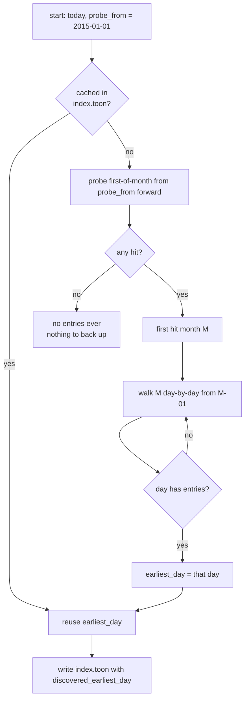
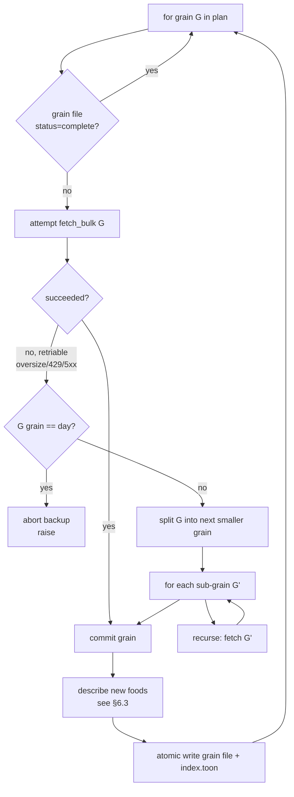
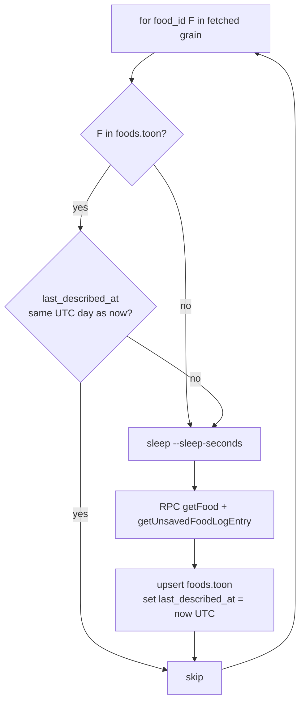
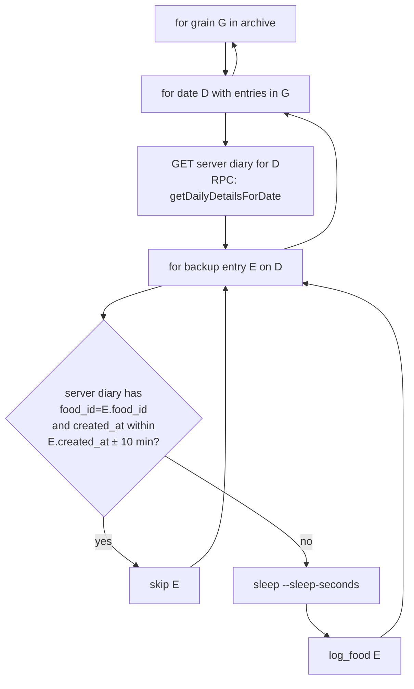
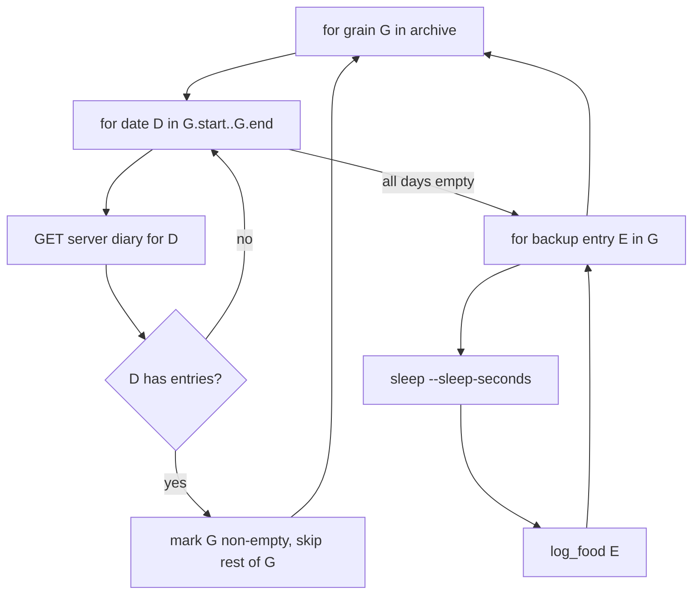

# Data-safety design spec (v2): backup, restore-backup, trash

> Status: design draft. This document describes intent; nothing here is
> implemented yet.

Covers three related features for protecting the food diary against
loss:

- §1-§8, §10-§13 — `loseit backup` and `loseit restore-backup`.
- §9 — Trash sink for `loseit delete` (CLI + SDK + agent frameworks).

## 1. Goal

Capture a complete, idempotent, resumable archive of the user's
Lose It! food diary on local disk, and be able to restore it back
into a Lose It! account. (§9 covers the complementary problem of
making individual deletes recoverable.)

## 2. Storage layout: one file per grain

A single multi-megabyte TOON file would defeat the whole point of TOON
(human-readable). Instead the backup is sharded into one TOON file per
**grain** — by default, one file per month.

```
~/.config/loseit/backup/
  index.toon                          <- global "what do we have?" summary
  2019/
    08.toon                           <- August 2019: entries
    09.toon
    ...
  2020/
    01.toon
    ...
  2026/
    06.toon
```

```
$ loseit backup --grain month      # default
$ loseit backup --grain week
$ loseit backup --grain day
```

| `--grain` | File layout                                    | Best for                                          |
|-----------|------------------------------------------------|---------------------------------------------------|
| `day`     | `YYYY/MM/DD.toon`                              | Tiny diffs, surgical inspection.                  |
| `week`    | `YYYY/Www.toon` (ISO week, e.g. `2024/W33.toon`) | Weekly cooking-pattern review.                  |
| `month`   | `YYYY/MM.toon`  *(default)*                    | Human-scannable + good Git diff size; max allowed. |

`year` is **not** a permitted grain. A year is too likely to overflow
whatever per-response page limit the Lose It! API enforces on a bulk
endpoint (existing or future), and the recursive fall-back in §6.1
gives no benefit when the natural ceiling for safe bulk fetches is
already a month.

Default root: `~/.config/loseit/backup/`. Override with `--root PATH`.

A user opening the folder in Finder sees at a glance what's been
captured — no scrolling a 50 MB single file looking for date holes.

## 3. CLI interfaces

### 3.1 `loseit backup`

```
loseit backup [OPTIONS]
```

Walk every grain in the date range, fetch its days, cache each unique
food's full description, and write everything into one TOON file per
grain. Safe to interrupt: every grain-file is rewritten atomically per
day, so the last completed day is always durable.

```
Options:
  --root PATH                 Backup root. Default: ~/.config/loseit/backup.
  --grain {day,week,month}
                              Granularity of the on-disk files. Default: month.
  --start YYYY-MM-DD          First date to fetch (inclusive).
                              Default: discover via probe (see §5).
  --end   YYYY-MM-DD          Last date to fetch (inclusive). Default: today.
  --probe-from YYYY-MM-DD     Earliest date the start-date probe will consider.
                              Default: 2015-01-01.
  --sleep-seconds FLOAT       Seconds between per-day fetches. Default: 1.0.
  --resume / --no-resume      Skip days already recorded in their grain file.
                              Default: --resume.
  --refresh-foods / --no-refresh-foods
                              Re-fetch food descriptions even if cached locally.
                              Default: --no-refresh-foods.
  --dry-run                   Print the plan (range, grains, days) and exit.
  -o, --output text|json|toon Format for the summary printed at end.
                              Default: text. Has no effect on the archive files.
```

Every grain row in the output reports one of four statuses, so it's
always explicit which periods were skipped because they were already
on disk and which are being fetched fresh:

| status      | meaning                                                                  |
|-------------|--------------------------------------------------------------------------|
| `skip`      | Grain file exists and is complete. Zero RPCs.                            |
| `partial`   | Grain file exists but some days are missing (interrupted prior run).     |
| `fetch`     | Grain file does not exist. Fetch every day.                              |
| `fallback`  | Grain-level fetch raised oversize/5xx/429; recursed into smaller grains. |

#### Example: first run, default grain

```
$ loseit backup
discovering earliest day...
  probed 2015-01 .. 2015-12   12/12 empty
  probed 2016-01 .. 2016-12   12/12 empty
  probed 2017-01 .. 2017-12   12/12 empty
  probed 2018-01 .. 2018-12   12/12 empty
  probed 2019-01 .. 2019-07    7/7  empty
  probed 2019-08              hit
  narrowing within 2019-08:
    probed 2019-08-01 .. 2019-08-13   empty
    probed 2019-08-14              hit
earliest day:         2019-08-14
range:                2019-08-14 -> 2026-06-12  (2495 days, 83 months)
grain:                month
root:                 /Users/eric/.config/loseit/backup

fetch     2019/08.toon   18 days  [######################]   3 entries
fetch     2019/09.toon   30 days  [######################]  12 entries
fetch     2019/10.toon   31 days  [######################]   0 entries  (empty month)
...
fetch     2026/06.toon   12 days  [######################]  42 entries

summary
  months fetched:     83  (skipped 0,  partial 0,  fetched 83,  fell back 0)
  days fetched:       2495
  days with entries:  2358
  unique foods:       312 described,  0 re-described today
  archive size:       11.4 MB
  root:               /Users/eric/.config/loseit/backup
```

(Coloring: only **paths, dates, counts, and sizes** are colored — the
data that belongs to Eric. Labels like `fetch`, `skip`, `summary` stay
default colour. No emojis.)

#### Example: resume after a Ctrl-C (most grains already on disk)

The previous run completed through 2026-04. Resume:

```
$ loseit backup
discovering earliest day... cached (index.toon)
earliest day:         2019-08-14
range:                2019-08-14 -> 2026-06-12  (2495 days, 83 months)
grain:                month
root:                 /Users/eric/.config/loseit/backup

skip      2019/08.toon   complete (18 days, 3 entries)
skip      2019/09.toon   complete (30 days, 12 entries)
...
skip      2026/04.toon   complete (30 days, 124 entries)
partial   2026/05.toon   need 8 more days (3 already on disk)
            fetch 2026-05-04 .. 2026-05-31  [######################]  14 entries
fetch     2026/06.toon   12 days  [######################]  42 entries

summary
  months total:        83
  months skipped:      80  (already complete on disk)
  months partial:       1  (resumed mid-grain)
  months fetched:       2  (no prior file)
  months fell back:     0
  days fetched:        20
  days with entries:   18
  unique foods:         0 new,  0 re-described today  (312 cached)
  root:               /Users/eric/.config/loseit/backup
```

The `skip` lines are emitted for every already-complete grain — there
is no "up to date: 80/83" one-liner that hides which months were
covered. A user scrolling the output can confirm by eye that, say,
`2022/03.toon` was honored as already-on-disk rather than re-fetched.

If the output is too noisy with hundreds of `skip` lines for archives
spanning many years, the user can pass `--quiet-skips` to collapse
contiguous skip ranges into one line per range:

```
skip      2019/08.toon .. 2026/04.toon   80 grains complete (2349 days, 4146 entries)
partial   2026/05.toon   need 8 more days (3 already on disk)
            fetch 2026-05-04 .. 2026-05-31  [######################]  14 entries
fetch     2026/06.toon   12 days  [######################]  42 entries
```

#### Example: narrow window, no discovery

```
$ loseit backup --start 2024-03-01 --end 2024-03-31
range:                2024-03-01 -> 2024-03-31  (31 days, 1 month)
grain:                month
root:                 /Users/eric/.config/loseit/backup

fetch     2024/03.toon   31 days  [######################]  118 entries

summary
  months fetched:      1
  days fetched:       31
  days with entries:  29
  unique foods:       43 described  (37 new, 6 re-used, 0 re-described today)
  root:               /Users/eric/.config/loseit/backup
```

#### Example: grain-level fall-back to days

A hypothetical bulk endpoint (§6.1) returns oversize for a busy month;
the algorithm splits it into days transparently:

```
$ loseit backup --start 2024-12-15 --end 2024-12-31
range:                2024-12-15 -> 2024-12-31  (17 days, 1 month)
grain:                month
root:                 /Users/eric/.config/loseit/backup

fetch     2024/12.toon
            attempt month -> oversize response, falling back to day
            fetch 2024-12-15 .. 2024-12-31  [######################]  76 entries
fallback  2024/12.toon   succeeded at day grain  (17 days, 76 entries)

summary
  months fetched:      1
  months fell back:    1  (oversize: month -> day)
  ...
```

#### Example: dry-run

```
$ loseit backup --dry-run
discovering earliest day... cached (index.toon)
plan
  range:              2019-08-14 -> 2026-06-12  (2495 days, 83 months)
  grain:              month
  already on disk:    80 months  (skip)
  partial on disk:     1 month   (partial: 8 days to fetch)
  no file yet:         2 months  (fetch)
  total RPCs est.:    ~3 grain RPCs + ~10 new food descriptions = ~13
                       (1 RPC per grain via getDailyDetails...ForDateRange;
                        partial grain re-fetches its whole month)
  est. wall time:     ~15 s @ 1s sleep
  root:               /Users/eric/.config/loseit/backup
no RPCs sent.
```

### 3.2 `loseit restore-backup`

```
loseit restore-backup [OPTIONS]
```

Walk every grain file in the backup root and re-log any backup entry
that doesn't already exist on the server.

Idempotency mode is controlled by `--skip-restore-on-nonempty-grain-
time-ranges`. See §7 for the full algorithm.

```
Options:
  --root PATH                 Backup root. Default: same as `backup`.
  --grain {day,week,month}    Grain to walk. Default: month.
                              (Affects per-grain reporting + the cheap mode below;
                              the file layout on disk is independent.)
  --start YYYY-MM-DD          Earliest grain to restore. Default: archive's earliest.
  --end   YYYY-MM-DD          Latest grain to restore. Default: archive's latest.

  --skip-restore-on-nonempty-grain-time-ranges
                              SIMPLE MODE. Walk each grain's days in order, early-
                              exiting as soon as the server returns any entry for
                              one of them. If the grain has any data, skip it
                              entirely — even if the backup has more entries than
                              the server. If all days are empty, log every backup
                              entry in the grain. Default: off.

                              Simple mode is cheaper on reads (early-exit per
                              grain) but coarser on writes (whole-grain skip or
                              whole-grain log). It also doesn't need the SDK to
                              surface FoodLogEntry.created_at — it ships first
                              (see §13).

                              Default (without this flag): SAFE MODE. For each
                              day in the archive with entries, query the server's
                              diary for that day and upsert each backup entry by
                              (food_id, created_at ± 10 minutes). Never double-
                              logs, never misses. No early-exit — every day in
                              the archive needs its read.

  --strict-account            Refuse to restore if the file's `account.user_id`
                              doesn't match the current account. Default: on.
  --sleep-seconds FLOAT       Seconds between log calls. Default: 1.0.
  --dry-run                   Print the plan and exit.
  -o, --output text|json|toon Format for the summary. Default: text.
```

There is **no `--reconcile`, no `--bulk-ack`, no delete path**.
Restore is purely additive in both modes — see §7.4.

#### Example: dry-run restore into a fresh account (default mode)

```
$ loseit restore-backup --dry-run
account:              loseit user_id 53539329
backup root:          /Users/eric/.config/loseit/backup
grain:                month
mode:                 safe (upsert by food_id + created_at ± 10m)
plan
  grains in archive:    83
  days with entries:    2358
  read RPCs:            ~2358   (to compare each day vs. server)
  log RPCs (upper):     4218    (every entry, if server is empty)
  est. wall time:       ~110 minutes @ 1s sleep
no RPCs sent.
```

#### Example: real restore, mostly already present (default mode)

Per-grain reporting in safe mode is per-day-with-entries:

| status     | meaning                                                                |
|------------|------------------------------------------------------------------------|
| `upsert`   | One or more backup entries were missing; logged the missing ones.      |
| `present`  | All backup entries for the day already on server (by match key).       |
| `empty`    | Backup has no entries for this day — nothing to do.                    |

```
$ loseit restore-backup
account:              loseit user_id 53539329
backup root:          /Users/eric/.config/loseit/backup
grain:                month
mode:                 safe (upsert by food_id + created_at ± 10m)

2019/08.toon  18 days with entries  [######################]
                 present  18   upsert  0   empty  0
2019/09.toon  26 days with entries  [######################]
                 present  26   upsert  0   empty  0
...
2026/05.toon  18 days with entries  [######################]
                 present  16   upsert  2   empty  0   (logged 5 new entries)
2026/06.toon   8 days with entries  [######################]
                 present   8   upsert  0   empty  0

summary
  grains scanned:       83
  days scanned:         2358
  days fully present:   2356
  days upserted:           2
  entries already present: 4213
  entries logged:           5
  root:                 /Users/eric/.config/loseit/backup
```

#### Example: real restore, cheap mode

```
$ loseit restore-backup --skip-restore-on-nonempty-grain-time-ranges
account:              loseit user_id 53539329
backup root:          /Users/eric/.config/loseit/backup
grain:                month
mode:                 simple (skip grain on first non-empty day in range)

scanning server for existing data...
skip      2019/08   31 days scanned, non-empty on day 2 -> skip
skip      2019/09   30 days scanned, non-empty on day 1 -> skip
...
skip      2026/04   30 days scanned, non-empty on day 1 -> skip
restore   2026/05   31 days scanned, all empty  (32 entries to log)
restore   2026/06   12 days scanned, all empty  (42 entries to log)

2026/05.toon   32 entries  [######################]
2026/06.toon   42 entries  [######################]

summary
  grains scanned:       83
  read RPCs (server):   ~150  (early-exit on first hit per grain)
  grains skipped:       81  (server already had data in range)
  grains restored:       2
  entries logged:       74
  root:                 /Users/eric/.config/loseit/backup
```

The read-RPC count in simple mode is dominated by how quickly each
grain's first non-empty day is found: grains where the user logs daily
exit after the first probe; grains where the user logged sparsely
walk further. For Eric's profile, ~150 reads vs. ~2358 in safe mode.

Same `--quiet-skips` flag as `backup` collapses long skip ranges.

(Again: only paths, ids, counts get colour.)

## 4. File schema

### 4.1 Grain file (`YYYY/MM.toon`)

Grain files are **stateless**. A file's existence means "the backup was
done for this grain"; its non-existence means "no backup yet." There
is no `status: in_progress` or `fetched_through: 2019-08-15` —
partial-grain progress lives in memory only, and a Ctrl-C mid-grain
discards it. The next run re-fetches that grain from scratch.

Why: server state can drift independently of the file. The user could
restore from this backup, then accidentally wipe the server, then run
backup again. A `status: complete` flag would lie at that point. The
file's contents are the only truth it can honestly assert.

```
schema_version: 1
account:
  user_id: "53539329"
  user_name: you@example.com
grain:
  kind: month
  start: 2019-08-01
  end: 2019-08-31
generated_at: 2026-06-12T20:00:00+00:00

# All entries logged anywhere in the grain. Ordered (day_num asc,
# meal_ordinal asc, created_at asc) so diffs between two snapshots
# are stable. The rows are the truth: an empty entries[] means the
# entire grain has been backed up and contained no entries.
# Each entry carries the food_name / food_brand / etc. AS THEY WERE
# at ingest_ts; that's how this file preserves the slowly-changing-
# dimension history without needing a foods/ archive.
entries[N]:
  - date: 2019-08-14
    day_num: 6435
    meal: lunch
    meal_ordinal: 1
    food_id: 5c7218603fd35a86bc4fac771a54560d
    food_name: "Xtreme Wellness Tortilla Wrap..."
    food_brand: "Carb balance "
    food_category: Tortilla
    food_identifier_code: DoP_mj
    food_measure_ordinal: 27
    food_measure_unit: serving
    servings: 1.0
    calories: 70.0
    nutrients: {"0": 70.0, "9": 300.0, ...}
    nutrients_by_label: {calories: 70.0, sodium_mg: 300.0, ...}
    entry_pk_response: [-2, 99, 41, ...]
    food_pk_response:  [92, 114, 24, ...]
    entry_day_key: Z66oWlo
    context_day_key: Z66oWlo
    hours_from_gmt: -6
    # When the user originally logged this entry on loseit.com — read
    # from FoodLogEntry.f4 (the "created" long in the wire shape; see
    # daily.py:136). This is the join key the upsert restore mode (§7)
    # uses, with a ±10 minute window for clock drift.
    created_at: 2019-08-14T12:34:08+00:00
    # When the entry was last edited (servings tweaked, etc.) on the
    # server. Equals created_at if never edited. From FoodLogEntry.f5.
    modified_at: 2019-08-14T12:34:08+00:00
    # When THIS BACKUP recorded the row. Useful for auditing the file.
    ingest_ts: 2026-06-12T20:00:01+00:00
```

### 4.2 Food cache file (`foods.toon`)

Held at the backup root so descriptions de-dupe across grains. Stores
the **latest** describe per food_id plus the UTC timestamp it was
captured. Historical food data (older name / brand / nutrient values)
is preserved in the grain files' per-entry snapshots — those rows are
never rewritten once committed.

`last_described_at` is what gates the "once per UTC day" rule in §6.3.

```
schema_version: 1
account:
  user_id: "53539329"
  user_name: you@example.com
foods{M}:
  5c7218603fd35a86bc4fac771a54560d:
    # Re-describe gate: if today's UTC date matches the date portion of
    # last_described_at, the backup loop skips this food. Otherwise it
    # re-describes and overwrites the body of this record.
    last_described_at: 2026-06-12T20:00:04+00:00
    first_seen_date: 2019-08-14
    last_seen_date: 2026-06-12
    name: "Xtreme Wellness Tortilla Wrap..."
    brand: "Carb balance "
    category: Tortilla
    primary_serving: {ordinal: 27, unit: serving, ...}
    cross_class_conversion: {per_serving_g: null, per_serving_ml: null}
    nutrients_per_serving: {calories: 70.0, ...}
    raw_nutrients_by_ord: {"0": 70.0, ...}
  ...
```

### 4.3 Index file (`index.toon`)

A tiny top-level summary that caches the discovery probe (§5) so
re-runs don't repeat the monthly walk. It does NOT mirror grain-file
state — grain files are stateless (§4.1) and re-scanning the
`YYYY/MM.toon` tree is fast enough.

```
schema_version: 1
account:
  user_id: "53539329"
  user_name: you@example.com
grain: month
discovered_earliest_day: 2019-08-14
discovered_at: 2026-06-12T20:00:00+00:00
```

Backup and restore-backup walk the on-disk grain files (`glob
YYYY/MM.toon`) every run to decide what's present. Cheap: a `stat`
per grain file, no parsing required until the file actually needs to
be read.

### 4.4 Is the schema sufficient to re-log? (validation)

Two distinct things have to be sufficient: the **log payload** and the
**upsert match key**.

#### Log payload

`LoseIt.log_food(food, meal, servings, when, ...)` — its required
inputs and the schema fields that supply them:

| `log_food` parameter           | Source in grain file              | Notes                                 |
|--------------------------------|-----------------------------------|---------------------------------------|
| `food` (id or `FoodSearchResult`) | `entries[].food_id`               | 32-char hex; `LoseIt.log_food` accepts it directly. |
| `meal` (`MealType` or int)     | `entries[].meal_ordinal`          | 0..3.                                  |
| `servings` (float)             | `entries[].servings`              | Canonical multiplier.                  |
| `when` (date)                  | `entries[].date`                  | Parsed back from ISO.                  |
| optional: `serving_unit`       | n/a                               | Not used — `servings` already canonical. |
| optional: `serving_amount`     | n/a                               | Not used.                              |

What the SDK re-derives from `food_id` at log time (not stored in the
grain file's re-log path):

- `food_name`, `food_brand`, `food_category` — re-fetched via `getFood`.
- `food_measure_ordinal` — re-fetched via `getUnsavedFoodLogEntry`.
- `nutrients` — re-fetched via `getUnsavedFoodLogEntry`.

So the **minimum log payload** is `(food_id, meal_ordinal, servings, date)`.

#### Upsert match key

The default restore mode (§7) needs to decide "does this backup entry
already exist on the server?" without depending on the entry-PK
(which is server-minted and changes every re-log). The match key is:

```
upsert_key = (food_id, created_at ± 10 minutes)
```

Both halves are durable:

- `food_id` is stable across server-side edits to the food's
  metadata, because Lose It! keeps the same primary key.
- `created_at` is captured from `FoodLogEntry.f4` on the server's
  diary payload (see `daily.py:136`), which is also stable across
  edits — `modified_at` (`f5`) changes when the user edits servings
  or moves a meal, but `created_at` doesn't.

If the SDK doesn't yet surface `f4`/`f5` on `FoodLogEntry` (it
currently does not), that's a prerequisite for implementing the
upsert mode. See §13.

Everything else in the grain file (food_name, brand, nutrients,
entry_pk, day_keys, etc.) is for human readability + diff review +
the "describe before delete" trash use case (§9), not for restore.

## 5. Discovery: finding the earliest log day

The Lose It! server answers diary queries for *any* date (even
2010-01-01 — verified), returning an empty diary. So "is this period
empty?" still requires a real fetch. Cleverness is in **how many** we
send.

With the range endpoint confirmed (§6.1), the cheapest probe shape is
one **range RPC per year**: ask for `Jan-1 .. Dec-31` of a candidate
year in one call and look at the `DailyDetails[]` for any non-empty
`food_log_entries`. Worst case for `probe_from=2015-01-01`: 11 yearly
range probes, ~12 seconds wall time at `--sleep-seconds 1`. Once a
year hits, drop to month-level probes inside that year, then to
day-level inside the first hit month.

Even with the bulk form, the monthly walk shown in §5.2 is kept as a
**fallback** — if a yearly range RPC ever returns oversize (a heavy
logger could plausibly produce thousands of entries in a year), the
recursive split absorbs it the same way `fetch_bulk` does.

### 5.1 Why not yearly/quarterly *single-day* probes

A first instinct is to probe one day per year and only zoom in on the
year with a hit. That breaks for anyone who started logging late in a
year:

```
year   Jan-1                                       <- yearly probe
2018   .                                              .  = no entries
2019   .   actual logging started Aug 14   * * * *   *  = entries
2020   *                                              ? = unknown
```

The 2019 yearly probe (Jan-1) is empty, so the yearly algorithm would
report 2020 as the earliest year. Wrong by 5 months.

Same flaw at quarterly granularity — a user who started in November of
some year would have Q1-3 of that year empty.

A **yearly range RPC** sidesteps that flaw entirely: the response
covers every day in the year, so we just look for the earliest
non-empty `DailyDetails` block in the array. That's the v1 algorithm.
If yearly ranges turn out to be capped or rejected by the server, the
monthly probe path described in §5.2 is the safe fallback — same
correctness story, more RPCs.

### 5.2 What discovery looks like as a picture

Months on a timeline. Each cell is the first-of-month probe.

```
year   Jan Feb Mar Apr May Jun Jul Aug Sep Oct Nov Dec
                                                              .  = probe empty
2015    .   .   .   .   .   .   .   .   .   .   .   .         *  = probe hit
2016    .   .   .   .   .   .   .   .   .   .   .   .         ?  = not probed yet
2017    .   .   .   .   .   .   .   .   .   .   .   .
2018    .   .   .   .   .   .   .   .   .   .   .   .
2019    .   .   .   .   .   .   .   *   ?   ?   ?   ?      <- first hit, stop probing
2020    ?   ?   ?   ?   ?   ?   ?   ?   ?   ?   ?   ?
```

Then narrow within the first hit month — `2019-08-01` was empty, so
walk forward day by day until the first hit:

```
2019-08:
  01 02 03 04 05 06 07 08 09 10 11 12 13 14 15 ...
  .  .  .  .  .  .  .  .  .  .  .  .  .  *           <- earliest day
```

Walks day-by-day rather than binary-searching: a user could plausibly
log only the 14th and 15th of their first month (started a fad diet on
a Wednesday and stopped Friday), and binary search would skip them.

### 5.3 Discovery as a flow chart



### 5.4 Cost

With the **range-RPC** path (v1 default):

| Step                  | RPC count                                            |
|-----------------------|------------------------------------------------------|
| Yearly range probes   | (years from probe_from to first-hit year) + 0       |
| Month-narrow in hit year | up to 12 monthly range probes (or 1 if year RPC payload is parseable for first-hit month directly) |
| Day-narrow in hit month  | up to 31 daily probes                              |

Worst case for `probe_from = 2015-01-01`:

- 11 yearly probes if every year is empty (`--start` is then meaningless).
- For a real account like Eric's (started 2019-08-14): 5 yearly probes
  (2015-2019, first hit on 2019) + ~7 monthly probes within 2019
  + up to 14 daily probes within August.

Typical first-run discovery: **~10-30 RPCs, ~15-30 s** with
`--sleep-seconds 1`. Cached in `index.toon` afterwards — subsequent
runs skip it entirely.

If yearly ranges are server-capped (not yet probed), the algorithm
recurses into monthly probes — the worst-case monthly path is the
~50-90 RPC cost from earlier drafts of this spec.

The user can short-circuit with `--start YYYY-MM-DD`. Discovery is
skipped in that case.

## 6. Fetch primitive: grain-at-a-time, recursive fall-back

The conceptual unit of work is a **grain**, not a day. Backup tries to
fetch the whole grain in one shot. If that fails, it splits the grain
into the next-smaller grain and retries each piece. The recursion
floor is one day; if a single day fails, the backup aborts.

```
fetch(grain G):
    try:
        commit(fetch_bulk(G))         # one or few RPCs covering G entirely
    except TooMuchData, RateLimited, ServerError:
        for G' in split_one_step(G):  # month -> 4 or 5 weeks; week -> 7 days
            fetch(G')
```

The biggest allowed grain is a **month**. `year` is rejected at CLI /
SDK validation time — see §2.



### 6.1 What "bulk fetch" means

`getDailyDetailsIncludingPendingForDateRange` is a real, live, server-side
endpoint — confirmed in-app by clicking "My Week" on the Lose It! home
dashboard and capturing the resulting RPC (see fixtures
`tests/conformance/fixtures/get_daily_details_for_date_range_{request,response}.txt`).
One click → one RPC → seven `DailyDetails` blocks in the response.

`fetch_bulk(G)` issues exactly **one** RPC per grain by default:

```
fetch_bulk(2024-03):
  RPC getDailyDetailsIncludingPendingForDateRange(
        start=DayDate(2024-03-01), end=DayDate(2024-03-31))
  if 413 / oversize / 429 / 5xx:
    raise TooMuchData         # caller drops to smaller grain
  else:
    decode N DailyDetails blocks, commit grain
```

Method signature (4-arity, from the captured envelope):

```
getDailyDetailsIncludingPendingForDateRange(
  token: ServiceRequestToken,
  user_id: UserId,
  start: DayDate{ key, day_num, hours_from_gmt },
  end:   DayDate{ key, day_num, hours_from_gmt },
) -> DailyDetails[]
```

Per-day (`getDailyDetailsIncludingPendingForDate`) stays in the SDK as
the **recursion floor** — once the splitter has narrowed to one day,
that's the call that fires. There is no hidden value in re-using the
range endpoint with `start == end`.

Server cap on range size has NOT been probed empirically; the
splitter's recursive fall-back means we don't need to know in advance.
The fast path is "try month, fall back on oversize."

#### Fallback chain

```
   try fetch_bulk(month)        ── one range RPC for the whole month
        │
        ├─ ok → commit
        │
        └─ oversize / 429 / 5xx
              │
              ▼
        for week in month:       ── one range RPC per week (≈5 RPCs)
            try fetch_bulk(week)
                ├─ ok → accumulate
                └─ oversize → for day in week: getDaily(day)
        commit
```

Month-grain `--grain month` runs ≈ 1 RPC; only the recursive fall-back
chain pays per-week (≈5) or per-day (≈30) costs.

### 6.2 Init-data caching (matters mainly for the day-grain fallback)

Today's per-day call (`get_daily_details`) issues two RPCs — one to
`getInitializationData` (for the day-key window) plus the diary call
itself. The range RPC needs `DayDate` objects for both start and end,
which also include `day_key` strings; the same caching applies.

The reverse-engineering comment in `core/init.py` confirms the server
**ignores the day_key** and routes by `day_num` alone, accepting any
non-empty string.

Backup will:

1. Call `getInitializationData` exactly **once** per backup run.
2. Cache the returned (day_num -> day_key) window for the few hundred
   days it covers.
3. For any day outside the cached window, pass the `"ZZZZZZZ"`
   placeholder day-key (already in the codebase as `_FALLBACK_DAY_KEY`).

This kept the per-day path at 1 RPC per day. With the range RPC as the
default, the optimization matters most when the splitter has fallen
back all the way to day-grain — which is the rare worst case, not the
default.

### 6.3 Describe-food: serial, once per UTC day per food_id

Food data is a **slowly-changing dimension** — Lose It! periodically
edits brand names, nutrient ordinals, category labels. We want to
capture those changes without re-describing the same food twice in the
same day.

Rule: for each unique `food_id` seen in a fetched grain, look up
`foods.toon`:

- If the food has no entry — describe it now.
- If the food has an entry whose `last_described_at` is on a different
  **UTC calendar day** from now — describe it now (re-capture the SCD).
- If the food has an entry whose `last_described_at` is on the **same
  UTC calendar day** as now — skip the describe.

Describe RPCs are issued **serially**, never concurrently, with
`--sleep-seconds` between them. Concurrent describe calls would
multiply the request load against the same endpoint family and is the
kind of thing that gets clients banned.



### 6.4 Atomic checkpoint per grain

When a grain completes:

1. Write the grain file to `<path>.tmp`.
2. `fsync`.
3. `os.replace(<path>.tmp, <path>)` — atomic.
4. Same for `foods.toon` and `index.toon`.

A Ctrl-C *between* grains is safe. A Ctrl-C *inside* a grain (mid-
bulk-fetch or mid-describe loop) loses the in-flight grain's progress;
the next run starts that grain from scratch. Within the grain we
de-dup by `entry_pk_response` so a partial re-fetch is safe.

## 7. Idempotency of `restore-backup` — two modes

Restore is idempotent in one of two ways. The default is **entry-level
upsert**; the opt-in `--skip-restore-on-nonempty-grain-time-ranges`
flag switches to **grain-level skip**.

### 7.1 Mode A (default): entry-level upsert

For each backup entry, look up the server's diary for that entry's
date. Match each backup entry to a server entry by:

```
(food_id, created_at ± 10 minutes)
```

- **Match found** -> the entry is already on the server. Skip.
- **No match** -> the entry is missing on the server. Log it.

±10 minutes is the "coarse time" window: enough slack to absorb a
re-log's tiny clock drift (the re-logged entry's `created_at` will be
the moment of the re-log, not the original — but within a 10-minute
fuzz, an originally-7:32 entry can match a re-logged 7:33 entry on
the next run and not be re-logged a second time).



Cost: 1 RPC per day-with-entries to read the server diary, plus 1 RPC
per missing entry to log it. For Eric's ~2358 days-with-entries
spanning ~4218 entries: ~2358 read RPCs + up to 4218 log RPCs in the
worst case (restoring into a fresh account). Read-side is paid even
when 100% of entries are already present.

This is **the safe default**: never double-logs, never silently
misses entries. The tradeoff is server load.

### 7.2 Mode B: grain-level skip (opt-in)

`--skip-restore-on-nonempty-grain-time-ranges` swaps Mode A's per-day
upsert for a coarser write decision:

> For each grain in the archive, walk every day in [grain.start,
> grain.end] and ask the server for that day's diary. As soon as one
> day reports any entry, the grain is "non-empty" and we skip it
> entirely. Otherwise (all days empty), log every backup entry in the
> grain blindly.

Critical: this mode still reads every day in the grain. A "1-3 probe
days" shortcut would miss the case where the user only logged on a
few sparse days inside the grain. The win Mode B gives up is **not**
read RPCs; it's the SDK prerequisite (no `FoodLogEntry.created_at`
needed) and the upsert match logic.



Cost: up to D reads per grain (D = days in the grain), early-exit on
the first non-empty day. Plus log RPCs for grains the server reports
fully empty.

The honest failure mode: if the server has *one* mobile-logged entry
in a grain the backup has 50 entries for, this mode restores nothing.
The user takes responsibility for choosing it.

### 7.3 Choosing a mode

| Situation                                               | Recommended mode                          |
|---------------------------------------------------------|-------------------------------------------|
| Restoring into a fresh (empty) account                  | Either — Mode B is cheaper on reads (early-exits per grain on a no-data grain too, since it scans all days and they're all empty). Same number of log RPCs in both. |
| Restoring into an account with some mobile-logged days  | Mode A (upsert) — only mode that won't miss entries. |
| One-off migration where you'll manually diff afterwards | Mode B with `--dry-run` first.            |
| You want a "sync" semantic (run it daily as a safety net) | Mode A (upsert) — only mode that's truly idempotent at the entry level. |
| The SDK doesn't yet surface `FoodLogEntry.created_at`   | Mode B — it ships before Mode A (see §13). |

### 7.4 Why no delete path

Restore is purely additive in both modes. The server has data the
archive doesn't? That's fine — Mode A leaves it alone, Mode B may
leave a whole grain alone. There is no `--reconcile strict` /
`--prune-extras` flag. The principle: this command only ever brings
the server *closer to* what the archive has. It never deletes.

If the user wants to wipe extras, that's an out-of-band manual step
using `loseit delete` per entry. Restore stays cheap to reason about.

## 8. Cases the design handles

| Case                                       | Handling                                                                                   |
|--------------------------------------------|--------------------------------------------------------------------------------------------|
| Ctrl-C mid-backup                          | The in-flight grain's progress is lost (grain files are stateless — §4.1). Rerun re-fetches that grain from scratch. Previously-completed grains are still on disk and skipped. |
| Network blip during a day's fetch          | The grain attempt fails and rolls back. Recursive split-and-retry (§6.1) drops to a smaller grain and retries; on day-grain failure the backup aborts and rerun retries from the same grain. |
| Lose It! rate-limit / 429                  | `--sleep-seconds` (default 1s) keeps load low. On 429, the grain aborts; the recursive split path treats 429 as "too much data" and tries again at a smaller grain. |
| Backup ported between machines             | Copy the `~/.config/loseit/backup` folder. Rerun.                                     |
| User switches accounts mid-archive         | `account.user_id` is pinned per file. Running against a different account refuses (`--strict-account`). |
| Restore into a fresh account (safe mode)   | Every day-with-entries gets one read RPC (returns empty), then every entry logged.         |
| Restore into the same account (safe mode)  | Every day's entries match by `(food_id, created_at ±10m)`. Zero log RPCs.                  |
| Restore into a partial account (safe mode) | Missing entries logged. Existing entries left alone. Never doubles, never misses.          |
| Restore into a partial account (cheap mode)| Server-populated grains skipped wholesale. Risk of missing data the user already accepted. |
| User wiped server, then ran backup, then restore  | Stateless grain files mean backup ran cleanly. Restore safe-mode re-logs every entry (server is empty). |
| Mobile-app late edits to a previously-backed-up grain | Default `--resume` skips grain files that exist. Workaround: `rm 2026/05.toon && loseit backup --start 2026-05-01 --end 2026-05-31`. |
| Lose It! changes nutrient ordinals         | The describe-cadence rule (§6.3) re-describes any food once per UTC day. Old grain-file entries keep historical projections. |
| Schema bump (`schema_version: 2`)          | Writer refuses to overwrite higher-version files. Reader refuses to load higher-version files. |

## 9. Trash for `delete`

The Lose It! API has no soft-delete or undo. To make every delete
recoverable, both the CLI and SDK route deletes through a **trash
sink** that captures the full entry payload before the wire delete
fires. The CLI ships with a sensible default; the SDK exposes a
pluggable interface so an agent framework can route the trash record
into its own durable medium (database, message bus, agent memory,
conversation log).

### 9.1 Goal

> A deleted entry is either recoverable from a trash sink, or it never
> happened. The wire delete only fires after the trash sink confirms
> it captured the entry.

This is one invariant, two implementations (CLI default, SDK
pluggable). The CLI is the easy-to-use case; the SDK protocol is what
makes the same guarantee available inside an agent framework.

### 9.2 SDK interface

The SDK exposes a `TrashSink` protocol — anything that implements it
can absorb deleted entries. `LoseIt.delete_entry` accepts a
`trash_sink=` keyword and, before issuing the wire delete:

1. Calls `trash_sink.stash(entry)`.
2. If it raises, **abort the delete**. The entry stays on the server;
   the caller sees the exception.
3. If it returns a `TrashReceipt`, attach the receipt to the
   `DeleteResult` returned to the caller.

```python
from typing import Protocol, runtime_checkable

@dataclass(frozen=True)
class TrashReceipt:
    """Returned by a TrashSink to identify *where* the entry was stashed.

    The fields are designed for echoing in conversation logs and
    audit trails:

    - ``where``     human-readable location ("trash.jsonl line 42",
                    "db row id=7", "slack message ts=…")
    - ``payload``   the JSON-safe entry dict — same shape as
                    FoodLogEntry.to_dict(). Always present so the
                    caller has the data inline in case ``where`` later
                    becomes inaccessible (container died, db wiped, …).
    - ``stashed_at`` UTC ISO — when the sink committed the row.
    """
    where: str
    payload: dict[str, Any]
    stashed_at: str  # UTC ISO

@runtime_checkable
class TrashSink(Protocol):
    """A sink for deleted entries. Implementations MUST be synchronous
    and MUST raise on failure — a sink that silently drops records
    would defeat the recovery contract."""

    def stash(self, entry: FoodLogEntry) -> TrashReceipt: ...

@dataclass(frozen=True)
class DeleteResult:
    """Return value of LoseIt.delete_entry."""
    entry: dict[str, Any]              # the deleted entry's JSON projection
    trash_receipts: list[TrashReceipt] # one per sink; multi-sink uses ChainedSink
    deleted_at: str                    # UTC ISO

class LoseIt:
    def delete_entry(
        self,
        entry: FoodLogEntry,
        *,
        trash_sink: TrashSink | None = ...,  # default below
        confirm: bool = False,
    ) -> DeleteResult: ...
```

### 9.3 Built-in sinks

The SDK ships three implementations covering the common cases:

| Class                  | What it does                                                   | Default? |
|------------------------|----------------------------------------------------------------|----------|
| `LocalFileTrashSink`   | Appends one JSON line to `~/.config/loseit/trash.jsonl`. `chmod 600`. | Yes — the CLI uses this. |
| `ConsoleTrashSink`     | Writes the entry's TOON (or JSON) projection to stdout/stderr. | No.      |
| `ChainedTrashSink`     | Fans the call out to N inner sinks; all must succeed.          | No.      |

```python
from lose_it.trash import (
    LocalFileTrashSink,
    ConsoleTrashSink,
    ChainedTrashSink,
)

# Default — same as the CLI.
li = LoseIt.from_env()                          # uses LocalFileTrashSink()
result = li.delete_entry(entry, confirm=True)
print(result.trash_receipts[0].where)
# -> "/Users/you/.config/loseit/trash.jsonl#42"

# Explicit local file with custom path.
li.delete_entry(
    entry,
    trash_sink=LocalFileTrashSink(path=Path("/tmp/trash.jsonl")),
    confirm=True,
)

# Belt and suspenders: persist to file AND echo to the agent's stdout.
sink = ChainedTrashSink([
    LocalFileTrashSink(),
    ConsoleTrashSink(format="toon", stream="stderr"),
])
li.delete_entry(entry, trash_sink=sink, confirm=True)

# Explicit opt-out (NOT recommended). The SDK refuses unless confirm=True
# AND the caller acknowledged they're discarding the recovery record.
li.delete_entry(entry, trash_sink=None, confirm=True)
# -> raises DeleteSafetyError("trash_required") unless the caller also
#    passed acknowledge_no_trash=True. (See open question §9.7.)
```

### 9.4 Agent-framework integration (Pydantic AI example)

For agent frameworks the goal is: the durable trash record lives in
**whatever the framework's runtime considers durable** — usually a
database, sometimes the conversation. The agent framework provides a
`TrashSink` that writes there; the LoseIt SDK doesn't have to know
anything about Pydantic AI / LangGraph / Inspect AI / etc.

```python
# Pydantic AI example.
from pydantic_ai import Agent, RunContext
from lose_it import LoseIt, FoodLogEntry
from lose_it.trash import TrashReceipt
from datetime import datetime, UTC
from dataclasses import dataclass

@dataclass
class Deps:
    li: LoseIt
    db: SomeKVStore  # your durable store

class DbTrashSink:
    """Persists trash records to the agent framework's durable KV.

    Implements lose_it.trash.TrashSink by structural typing — no
    inheritance needed (the protocol is Protocol-typed).
    """
    def __init__(self, db: SomeKVStore) -> None:
        self.db = db

    def stash(self, entry: FoodLogEntry) -> TrashReceipt:
        now = datetime.now(tz=UTC).isoformat()
        payload = entry.to_dict()
        row_id = self.db.put(f"trash/{now}", payload)
        return TrashReceipt(
            where=f"db:trash/{row_id}",
            payload=payload,
            stashed_at=now,
        )

agent = Agent("openai:gpt-4o", deps_type=Deps)

@agent.tool
def delete_meal_entry(ctx: RunContext[Deps], entry_id: str) -> str:
    entry = ctx.deps.li.find_entry(entry_id)
    result = ctx.deps.li.delete_entry(
        entry,
        trash_sink=DbTrashSink(ctx.deps.db),
        confirm=True,
    )
    # The trash receipt's `where` lands in the conversation log too,
    # so even if the DB later fails, the LLM transcript records the
    # location.
    return f"Deleted {entry.food_name}. trash: {result.trash_receipts[0].where}"
```

Two reasons this works cleanly for agents:

- The sink is **synchronous** and **raises on failure**. Agent tool
  decorators (`@agent.tool`) already turn exceptions into tool errors
  the LLM sees; the LLM gets a clear "delete failed because trash
  couldn't be written" instead of a silent data loss.
- The return value of `delete_entry` includes the receipt. Agent
  frameworks typically log tool return values to the conversation,
  so the receipt becomes part of the durable transcript automatically
  — no special wiring needed.

### 9.5 Trash file schema (`~/.config/loseit/trash.jsonl`)

`LocalFileTrashSink` writes one JSON object per line, append-only,
`chmod 600`. Each line is self-contained.

```jsonl
{"stashed_at": "2026-06-12T20:04:11+00:00", "user_name": "you@example.com", "entry": {"date": "2026-06-12", "day_num": 9294, "meal": "snacks", "meal_ordinal": 3, "food_id": "5c7218603fd35a86bc4fac771a54560d", "food_name": "Xtreme Wellness Tortilla Wrap", "food_brand": "Carb balance ", "food_identifier_code": "DoP_mj", "food_measure_ordinal": 27, "servings": 1.0, "calories": 70.0, "nutrients": {"0": 70.0, "9": 300.0}, "entry_pk_response": [-2, 99, 41], "food_pk_response": [92, 114, 24], "entry_day_key": "Z66oWlo", "context_day_key": "Z66oWlo", "hours_from_gmt": -6, "created_at": "2026-06-12T19:55:02+00:00", "modified_at": "2026-06-12T19:55:02+00:00"}}
```

The `entry` block is exactly `FoodLogEntry.to_dict()` — same shape the
backup spec uses, so a future tooling layer can read a trash file and
a grain file with the same parser.

### 9.6 CLI surface

**`loseit delete`** — adds two trash-related behaviors on top of the
existing flags (`--meal`, `--pick`, `--date`, `--yes`,
`--allow-historical`, etc.).

```
loseit delete [EXISTING OPTIONS] [TRASH OPTIONS]

Trash options:
  --trash-file PATH       Override the local trash file path.
                          Default: ~/.config/loseit/trash.jsonl.
  --print-deleted / --no-print-deleted
                          Echo the deleted entry to stdout (TOON if -o text,
                          JSON if -o json, TOON if -o toon). Default: on.
                          The output is a copy of the trash record.
                          Rationale: when the CLI runs in a container, the
                          local trash file may be on ephemeral storage;
                          the agent's conversation log is more durable.
  --no-trash              EXPLICIT opt-out. Refuses unless paired with
                          --i-know-this-is-unrecoverable. Not recommended.
```

Example:

```
$ loseit delete --meal lunch --pick 1
Deleting from lunch: Tortilla Wraps, ... (Mission) x 1.0
  trash sink: /Users/you/.config/loseit/trash.jsonl#42
  (run 'loseit restore-trash' to undo the most recent delete)

Type the food name exactly to confirm: 'Tortilla Wraps, ...'
food name: Tortilla Wraps, ...

# --print-deleted echoes the entry to stdout (TOON form here)
deleted_entry:
  date: 2026-06-12
  meal: lunch
  food_id: 5c7218603fd35a86bc4fac771a54560d
  food_name: Tortilla Wraps, ...
  servings: 1.0
  created_at: 2026-06-12T12:34:08+00:00
  ...
```

**`loseit restore-trash`** — re-log the most recent trash record.

```
loseit restore-trash [OPTIONS]

Options:
  --trash-file PATH       Source trash file. Default: ~/.config/loseit/trash.jsonl.
  --line INT              Restore the entry on line N (1-based) instead of the last.
  --keep / --consume      Keep the trash line after restoring, or remove it (default).
                          Default: --consume.
  --dry-run               Print which line would be restored without re-logging.
  -o, --output text|json|toon  Format for the summary.
```

Example:

```
$ loseit restore-trash
restoring trash#42 (last line)
  food: Tortilla Wraps, ... (Mission)
  meal: lunch
  date: 2026-06-12
  servings: 1.0

logged successfully (new entry id: ...)
trash#42 consumed.
```

The CLI restore replays the entry through `LoseIt.log_food(food_id=…,
meal=…, servings=…, when=…)` — same minimum-payload set §4.4 calls
out for backup restore.

### 9.7 Open questions for the trash design

1. **Should `trash_sink=None` be allowed?** Today the proposal says
   "yes, but only with `acknowledge_no_trash=True`." Alternative: hard
   refuse — every delete must have a sink. Forces the user to write
   `ConsoleTrashSink(stream="stderr")` even if they don't want
   persistence. *(Lean: keep the `acknowledge_no_trash=True` escape
   hatch.)*
2. **Async sinks.** Some agent frameworks (Inspect AI, custom Anthropic
   loops) are async-first. Should there be a `TrashSinkAsync`
   protocol with `async def stash(...)`? *(Lean: yes, v2. v1 keeps it
   sync and async users wrap with `asyncio.to_thread`.)*
3. **Sink failure observability.** When `ChainedTrashSink` runs N
   sinks and the 3rd fails, the first two have already written.
   Should the SDK try to roll them back? *(Lean: no — appending is
   the only operation, and an extra trash record never hurts.)*

## 10. SDK surface

```python
class LoseIt:
    def backup(
        self,
        root: Path = Path("~/.config/loseit/backup").expanduser(),
        *,
        grain: Literal["day", "week", "month"] = "month",
        start: date | None = None,
        end: date | None = None,
        probe_from: date = date(2015, 1, 1),
        resume: bool = True,
        refresh_foods: bool = False,
        sleep_seconds: float = 1.0,
        dry_run: bool = False,
        progress: Callable[[BackupEvent], None] | None = None,
    ) -> BackupSummary: ...

    def restore_backup(
        self,
        root: Path = Path("~/.config/loseit/backup").expanduser(),
        *,
        grain: Literal["day", "week", "month"] = "month",
        start: date | None = None,
        end: date | None = None,
        strict_account: bool = True,
        # False (default): safe upsert mode — per-day server reads + match by
        # (food_id, created_at ± upsert_window).
        # True:            simple mode — scan each grain's days with early-exit on
        #                  first non-empty day; skip whole grain on any hit.
        skip_restore_on_nonempty_grain_time_ranges: bool = False,
        upsert_window: timedelta = timedelta(minutes=10),
        sleep_seconds: float = 1.0,
        dry_run: bool = False,
        progress: Callable[[RestoreEvent], None] | None = None,
    ) -> RestoreSummary: ...
```

Backup composes a new range primitive (`diary_range`) plus existing
`describe_food` and the per-day `diary` (used as the recursion floor).
Restore composes existing `diary` + `log_food`. CLI commands are thin
wrappers.

A new SDK method `LoseIt.diary_range(start: date, end: date) -> dict[date, list[FoodLogEntry]]`
wraps `getDailyDetailsIncludingPendingForDateRange` (wire-confirmed
§6.1). The per-day `LoseIt.diary(when)` stays — it's the recursion
floor of the splitter.

The safe-mode upsert depends on `FoodLogEntry.created_at` /
`modified_at` being surfaced on the SDK's diary parser. Today these
are positionally noted in `daily.py:136` but not extracted. Adding
them is a prerequisite for restore-backup's safe mode (see §13).

The `progress` callback is what drives the rich progress bar in the
CLI examples (§3); the SDK itself is silent.

## 11. Open questions (still to resolve)

1. **Mobile late-edits.** Default `--resume` misses retroactive mobile
   edits to already-fetched days. Worth a `--rescan-recent INT`
   defaulting to 7? *(Lean: yes. Cheap; covers the common case.)*
2. **Restore probe placement.** §7.2 probes first/middle/last day per
   grain. Should middle-day be the *most-likely-non-empty* day instead
   (e.g. a Wednesday if the user logs more on weekdays)? *(Lean: keep
   it simple — first/middle/last.)*
3. **Compression.** `~/.config/loseit/backup/2019/08.toon.gz` is
   ~5x smaller. Worth a `--compress` flag? *(Lean: no for v1.
   Grep-ability wins.)*

## 12. Out of scope

- Weight history, custom foods, badges — not reverse-engineered.
- Cloud mirroring (Drive, Dropbox, S3). The local folder is canonical
  state; mirroring belongs in a separate tool.
- Schema migration tooling for `schema_version` bumps. Will be
  designed when (if) the bump happens.

## 13. Suggested implementation order

Trash (§9) is independent of backup and ships first — it protects
the data the backup is meant to capture.

1. **`TrashSink` protocol + built-ins** (`LocalFileTrashSink`,
   `ConsoleTrashSink`, `ChainedTrashSink`) + `DeleteResult`.
2. `LoseIt.delete_entry` rewritten to call `trash_sink.stash` before
   the wire delete; default sink = `LocalFileTrashSink`.
3. `loseit delete` CLI: `--trash-file`, `--print-deleted`, `--no-trash +
   --i-know-this-is-unrecoverable`.
4. `loseit restore-trash` CLI + matching `LoseIt.restore_trash` SDK
   method.

Then backup:

5. **`diary_range(start, end)`** — wrap
   `getDailyDetailsIncludingPendingForDateRange`. Build envelope
   modeled on `core/daily.py:build_payload` with the 4-arity signature
   captured in
   `tests/conformance/fixtures/get_daily_details_for_date_range_request.txt`.
   Decode the response as `dict[date, list[FoodLogEntry]]`.
   *Prerequisite for any bulk-grain fetch.*
6. **Surface `created_at` / `modified_at` on `FoodLogEntry`.** Extract
   from the FLE positional fields (`f4`/`f5`) the decoder already
   knows about (see `daily.py:136`). Pure SDK change, read-only.
   *Prerequisite for safe-mode restore-backup.*
7. `LoseIt.backup` SDK method, grain=month only (read-only). Uses
   `diary_range` as the base case; falls back to per-day on oversize.
8. `loseit backup` CLI wrapper, with rich progress reporter.
9. `LoseIt.restore_backup` SDK method, **cheap mode only** (grain-skip).
   No `created_at` dependency — works as soon as backup does. Uses
   `diary_range` to scan each grain.
10. `LoseIt.restore_backup` safe mode (upsert by `food_id + created_at ±10m`).
    Depends on step 6.
11. `loseit restore-backup` CLI wrapper exposing both modes.
12. `--grain {day,week}` for both.
13. Hermetic round-trip test: fixture diary -> backup -> wipe -> restore -> diff.
    Round-trips through both modes.
